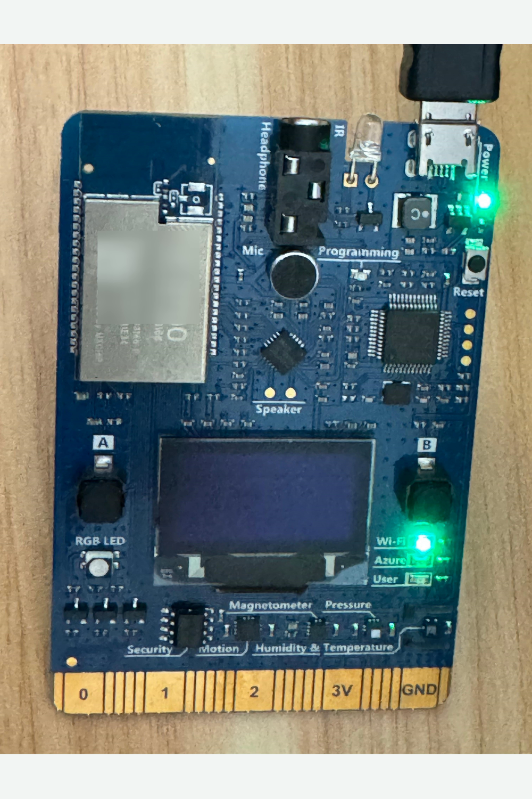
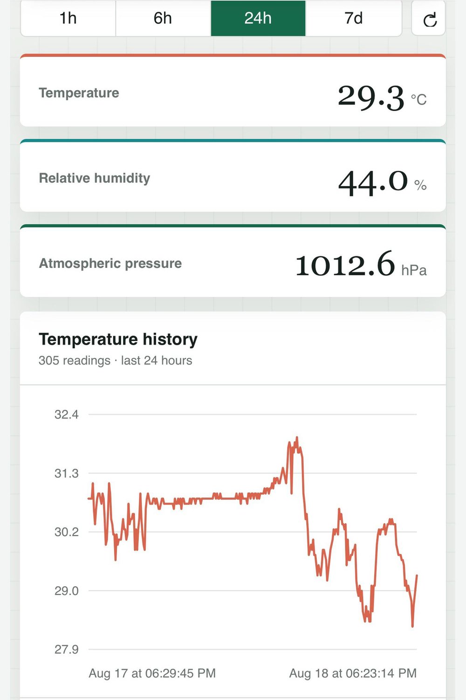
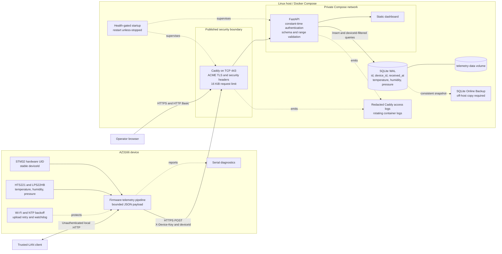

# HomeTemperature

HomeTemperature is an end-to-end environmental telemetry project for the
MXChip AZ3166. The firmware reads the onboard temperature, humidity, and
pressure sensors, serves the latest sample on the local network, and can upload
authenticated telemetry over HTTPS. A small FastAPI, SQLite, and Caddy service
stores the readings and serves an authenticated dashboard.

The firmware is also a starting point for other AZ3166 applications, with
reusable C++ components for connectivity, sensing, local discovery, uploads,
buttons, and watchdog recovery.

## Project Preview

| MXChip AZ3166 | Telemetry dashboard |
| :---: | :---: |
|  |  |
| On-device sensing, identity, connectivity, and upload control | Authenticated latest readings, history, and service state |

Hardware labels and deployment identifiers are redacted in the public images.

## Reusable Firmware Components

Use the complete application as a working example, or adapt the components you
need for another AZ3166 project. Hardware and network APIs are wrapped behind
small interfaces, with retry and scheduling policy kept separate from transport.

Sources are grouped by capability under `firmware/AZ3166/src/`: `config/`,
`connectivity/`, `http/`, `discovery/`, `telemetry/`, `cloud/`, `input/`, and
`platform/`. Headers stay beside their implementations, and the vendored
responder is isolated in `discovery/mdns/`.

| Capability | Components | What They Encapsulate |
| --- | --- | --- |
| Wi-Fi and time | `ConnectivityManager` | Connection state, reconnect backoff, IPv4 address changes, and NTP synchronization retries. |
| Local discovery | `LocalDiscovery`, `MdnsUdpTransport` | Caller-supplied mDNS service metadata, address-aware restarts, and background query handling, coordinated with HTTP listener readiness. |
| Sensor telemetry | `TelemetryService` | Serialized HTS221/LPS22HB acquisition, range validation, and bounded JSON formatting shared by local HTTP and cloud uploads. |
| Local HTTP | `LocalWebServer`, `LocalHttpHandler` | A dedicated HTTP worker, verified listener startup, bounded request/response I/O, and an injectable application handler. `TelemetryHttpHandler` supplies this application's telemetry route. |
| HTTPS delivery | `CloudTelemetry`, `TelemetryUploader` | Authenticated HTTPS transport, payload delivery, and typed sensor, network, and HTTP outcomes. |
| Upload control | `UploadScheduler`, `CloudUploadController` | Periodic uploads, retry timing, manual requests, and pause/resume behavior. |
| Button input | `ButtonDebouncer`, `ButtonController` | Active-low button sampling, debounce state, and one-shot application events. |
| Device identity | `DeviceIdentity` | A stable identifier derived from the STM32 hardware UID. |
| Watchdog recovery | `WatchdogController` | Watchdog setup, feeding, and reset-cause reporting. |

### Built for Adaptation and Testing

The sketch owns component wiring and loop order; components receive the state
or collaborators they need. Injectable clock and platform operations let the
tests exercise reconnects, retries, address changes, and failure handling
deterministically. A replaceable mDNS transport lets protocol tests inspect
datagrams without real Wi-Fi traffic. Focused test sketches share a build/upload
harness that restores production firmware after an on-board run.

The HTTP engine has no sensor, telemetry-schema, or mDNS dependency. Supply a
`LocalHttpHandler` for your application and, optionally, a service-lifecycle
callback to coordinate advertisement. Its worker serves local requests while
the main loop waits for cloud uploads; mDNS runs in its own worker so a slow
HTTP client cannot block discovery. See the embedding example in
[firmware/README.md](firmware/README.md#reusing-the-http-service).

Start with [firmware/AZ3166/AZ3166.ino](firmware/AZ3166/AZ3166.ino) to see the
composition, then [docs/firmware-design.md](docs/firmware-design.md) for component
boundaries and test coverage. Local sensing, HTTP, and discovery can be used
without deploying the hosted server or configuring cloud credentials. On an
mDNS-capable LAN client, the running device is accessible at
`http://az3166.local/api/telemetry`.

These are reusable source components, not a separately packaged or
board-independent SDK. Hardware adapters target AZ3166 Core 2.0.0, and the
telemetry schema, routes, and fixed hostname reflect this application. Adapt
those choices for your project and review
[THIRD_PARTY_NOTICES.md](THIRD_PARTY_NOTICES.md), including the vendored mDNS
library's LGPL terms.

## Architecture



Key design boundaries:

- **Device identity and authentication:** firmware derives a stable `deviceId`
  from the STM32 UID. Device writes use a shared `X-Device-Key`; dashboard and
  query reads use separate HTTP Basic credentials. Both cross the public
  boundary only over HTTPS.
- **Data model and multi-device isolation:** each row stores `device_id`, the
  server-generated UTC receipt time, temperature, humidity, and pressure. An
  index on `(device_id, received_at)` supports per-device latest, history, and
  count queries. This is logical query isolation, not tenant isolation: the
  shared writer key is not bound to the submitted `deviceId`.
- **Container and security boundary:** only Caddy publishes a host port. The API
  stays on the private Compose network, runs as a non-root user with a read-only
  root filesystem, and persists SQLite data in a named volume. Caddy removes
  `X-Device-Key` before writing access logs.
- **Failure handling:** firmware uses bounded Wi-Fi/NTP retries, classifies
  upload outcomes, and feeds a hardware watchdog. Compose health-gates Caddy on
  API startup and restarts failed containers; SQLite uses WAL transactions and
  the backup script takes consistent snapshots. A host or volume failure still
  requires operator recovery.
- **Observability:** firmware reports state over serial; Docker retains bounded
  API and Caddy logs; `/healthz` reports process liveness and authenticated
  `/api/v1/status` reports uptime and aggregate database state. Metrics, traces,
  alerts, and audit records are intentionally outside the current scope.

## Repository Layout

- `firmware/AZ3166/`: production Arduino sketch and modules
- `firmware/tests/`: compile-time and on-board firmware suites
- `firmware/tools/`: repository-owned AZ3166 build helpers
- `server/`: API, dashboard, containers, and deployment scripts
- `docs/`: implementation design documents

## Firmware Quick Start

The verified Windows toolchain is Arduino IDE 1.8.19 with AZ3166 Core 2.0.0
and board `AZ3166:stm32f4:MXCHIP_AZ3166`.

```powershell
& .\firmware\tools\Install-Az3166Toolchain.ps1

& .\firmware\tools\Invoke-Az3166Build.ps1 `
  -Action Verify `
  -Sketch .\firmware\AZ3166\AZ3166.ino

& .\firmware\tests\run-all-tests.ps1 -Action Verify
```

A clean checkout compiles with cloud upload disabled. To configure a private
deployment, copy the two examples and edit only the ignored local files:

```powershell
Copy-Item firmware/AZ3166/src/config/cloud_deployment.example.h firmware/AZ3166/src/config/cloud_deployment.h
Copy-Item firmware/AZ3166/src/config/cloud_secrets.example.h firmware/AZ3166/src/config/cloud_secrets.h
```

See [firmware/README.md](firmware/README.md) for installation, hardware tests,
and credential handling.

## Server Quick Start

```powershell
python -m venv .venv
.\.venv\Scripts\Activate.ps1
python -m pip install -r server/requirements-dev.txt
$env:PYTHONPATH = 'server'
python -m pytest server/tests -q
```

Production deployment uses Docker Compose. Copy `server/.env.example` to
`server/.env`, replace every placeholder, and follow
the [Azure VM deployment example](server/DEPLOY.md). Never commit `server/.env`
or device keys.

## Current Limitations

- The local firmware HTTP endpoint is intentionally unauthenticated and belongs
  only on a trusted LAN.
- One shared device key authenticates all writers; there is no per-device
  revocation, ownership model, or tenant boundary.
- The dashboard follows the most recently reporting device and does not yet
  provide a device registry or selector.
- `/healthz` checks process liveness, not database readiness; the deployment has
  no built-in alerting or high-availability failover.
- Telemetry retention and off-host backup scheduling are operator concerns.

Review [SECURITY.md](SECURITY.md) and the detailed design limitations before
exposing a deployment to the Internet.

## Documentation

- [Firmware design](docs/firmware-design.md)
- [Server design](docs/server-design.md)
- [Azure VM deployment example](server/DEPLOY.md)
- [Contributing](CONTRIBUTING.md)
- [Third-party notices](THIRD_PARTY_NOTICES.md)

## License

HomeTemperature is available under the [MIT License](LICENSE). Third-party
components and trust material retain their upstream terms.