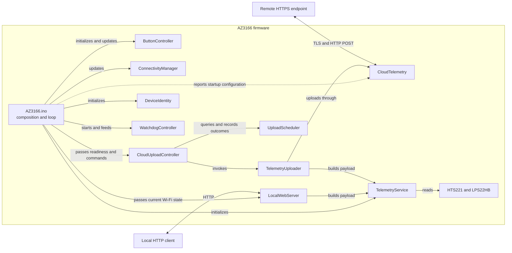

# AZ3166 Firmware Design

Status: current implementation as of 2026-08-18.

## 1. Scope

This document describes only the firmware that runs on the MXCHIP AZ3166. It
covers sensor acquisition, local HTTP telemetry, cloud upload, connectivity,
buttons, scheduling, watchdog behavior, platform compatibility fixes, and
firmware tests.

The implementation under `server/`, including ingestion, persistence,
dashboard, deployment, and operations, is outside the scope of this document.
The remote service appears here only as an HTTPS boundary used by the device.

## 2. Design Goals

- Expose current sensor readings over the local network.
- Upload the same telemetry shape to a configured HTTPS endpoint.
- Recover from Wi-Fi loss and delayed time synchronization without rebooting.
- Keep scheduling policy separate from transport and sensor code.
- Avoid Arduino `String` construction in the telemetry path.
- Bound application-owned buffers and reject truncated or invalid payloads.
- Keep hardware and network boundaries replaceable in focused tests.
- Use the hardware watchdog as recovery for unexpectedly long blocking calls.

## 3. System Context



Arrows inside the firmware boundary represent direct calls or dependencies.
`ConnectivityManager` and `LocalWebServer` do not reference each other:
`AZ3166.ino` reads current connectivity state and passes it to
`LocalWebServer::poll()`. For cloud upload, the composition root passes button
commands and the current Wi-Fi/time readiness state to `CloudUploadController`.
The controller owns the due check, one upload attempt, result classification,
and scheduler update. Constructor-only wiring is omitted from the diagram.

The firmware uses a cooperative, single-loop execution model. Modules expose
small synchronous operations; `AZ3166.ino` owns their construction and
decides when each operation runs. The application does not create its own
threads or RTOS tasks.

## 4. Source Organization

The production Arduino sketch root is `firmware/AZ3166/`. Arduino-recursive
production sources live in its flat `src/` directory, while focused test
sketches and staging scripts live separately under `firmware/tests/`.

| Area | Files | Responsibility |
| --- | --- | --- |
| Composition | `firmware/AZ3166/AZ3166.ino` | Creates long-lived objects, performs startup, and orchestrates the loop. |
| Configuration | `firmware/AZ3166/src/AppConfig.h` | Owns endpoint, port, timing, payload capacity, and watchdog constants. |
| Device identity | `firmware/AZ3166/src/DeviceIdentity.h/.cpp` | Derives and stores a stable identifier from the STM32 hardware UID. |
| Input | `firmware/AZ3166/src/ButtonDebouncer.h/.cpp`, `ButtonController.h/.cpp` | Converts active-low button samples into one-shot application events. |
| Watchdog | `firmware/AZ3166/src/WatchdogController.h/.cpp` | Owns watchdog configuration, reset-cause reporting, enabled state, and timer feeds. |
| Connectivity | `firmware/AZ3166/src/ConnectivityManager.h/.cpp` | Owns Wi-Fi reconnect policy, connection state, NTP retry, and connectivity events. |
| Sensor and JSON | `firmware/AZ3166/src/TelemetryService.h/.cpp` | Stores an injected device ID pointer, owns and reads sensor objects, and formats the shared telemetry payload. |
| Local HTTP | `firmware/AZ3166/src/LocalWebServer.h/.cpp` | Owns the AZ3166 TCP server and local HTTP protocol, using its injected `TelemetryService` for response payloads. |
| Upload workflow | `firmware/AZ3166/src/CloudUploadController.h/.cpp` | Gates attempts, translates upload outcomes into scheduling policy, and records completion-time results. |
| Upload coordination | `firmware/AZ3166/src/TelemetryUploader.h/.cpp` | Builds one payload and forwards its exact bytes and length to cloud transport. |
| Upload policy | `firmware/AZ3166/src/UploadScheduler.h/.cpp` | Decides when scheduled, retry, and manual uploads are due. |
| Upload result | `firmware/AZ3166/src/TelemetryUploadResult.h` | Carries typed upload status and the underlying network or HTTP detail code. |
| HTTPS transport | `firmware/AZ3166/src/CloudTelemetry.h/.cpp` | Builds the authenticated HTTPS request and classifies the response. |
| Core compatibility | `firmware/AZ3166/src/FloatFormatting.cpp` | Replaces the defective AZ3166 Core `dtostrf` implementation. |
| SDK behavior | `firmware/AZ3166/src/disable_system_telemetry.cpp` | Replaces SDK system telemetry hooks with no-op definitions. |

## 5. Startup and Main Loop

### 5.1 Startup

`setup()` performs the following sequence:

1. Starts serial output at 115200 baud and waits for the serial interface.
2. Reads the three STM32 UID words and formats the device ID.
3. Initializes both active-low buttons and their debounce state.
4. Reports a prior watchdog reset, then configures a 30-second watchdog.
5. Initializes the HTS221 temperature/humidity sensor and LPS22HB pressure
  sensor owned by `TelemetryService`.
6. Reports whether cloud upload has a usable device API key.

Wi-Fi connection is not performed in `setup()`. The first
`ConnectivityManager::update()` call in `loop()` starts the initial connection
attempt, allowing startup responsibilities to remain separate from ongoing
connection maintenance.

If device ID initialization fails, the firmware logs the error and continues.
Subsequent payloads use `az3166-FFFFFFFFFFFFFFFFFFFFFFFF` until the device is
restarted with successful initialization.

### 5.2 Loop Order

Each `loop()` iteration performs work in this order:

1. Reset the watchdog.
2. Update button state and apply upload or pause events.
3. Reset the watchdog.
4. Update Wi-Fi and time synchronization state.
5. Report new connectivity events.
6. Reset the watchdog.
7. Reconcile the local HTTP server with current Wi-Fi state and poll one client.
8. Reset the watchdog.
9. Pass current Wi-Fi/time readiness to `CloudUploadController`.
10. If configured and due, the controller performs one upload and records its
  result using the completion timestamp.

Cloud upload requires all of the following conditions:

- Wi-Fi is connected.
- System time is synchronized.
- The cloud API key is configured.
- `UploadScheduler` reports that an upload is due.

`AZ3166.ino` supplies only the first two conditions. The controller checks
configuration through `TelemetryUploader` and owns the scheduler transaction.

Time synchronization is a cloud gate because TLS certificate validation
depends on a valid clock. Local HTTP telemetry requires Wi-Fi but does not
require synchronized time or cloud configuration.

## 6. Connectivity Design

`ConnectivityManager` is the only application module that calls `WiFi.begin`,
`WiFi.disconnect`, `WiFi.status`, `SyncTime`, and `IsTimeSynced`.

### 6.1 Wi-Fi State and Retry

- The first update attempts a connection immediately.
- Every attempt calls `WiFi.disconnect()` before `WiFi.begin()` so the AZ3166
  station state is reset before reconnecting.
- Failed attempts use exponential delays of 5, 10, 20, 40, and then 60 seconds.
- The retry delay remains capped at 60 seconds.
- While connected, physical status is checked once per second.
- A detected disconnect clears both Wi-Fi and time-synchronized state and emits
  `wifiDisconnected`.
- Reconnection starts on a later loop iteration; a successful attempt emits
  `wifiConnected`.

The retry timestamps are captured after blocking platform calls complete. This
means a retry interval starts when an attempt finishes, not when it begins.
Unsigned `millis()` subtraction is used so interval checks remain valid across
counter wraparound.

### 6.2 Time Synchronization

After Wi-Fi connects, the manager checks whether the platform already has
synchronized time. If it does not, NTP synchronization is retried every 60
seconds. Losing Wi-Fi also clears the cached synchronized state.

`ConnectivityOperations` is a function table for current time, Wi-Fi, and NTP
operations. Production uses AZ3166 platform functions; tests inject deterministic
operations without changing the state machine.

## 7. Device Identity

`DeviceIdentity` reads three 32-bit UID words from STM32 address `0x1FFF7A10`
and produces this stable format:

```text
az3166-<UID0:8HEX><UID1:8HEX><UID2:8HEX>
```

The output is 31 characters plus the null terminator, matching
`DeviceIdentity::DEVICE_ID_SIZE == 32`. The generated value contains only the
fixed prefix and uppercase hexadecimal characters, so it can be inserted into
the current JSON payload without an escaping step.

The process-lifetime `DeviceIdentity` instance owns the ID buffer and its
initialized state. Before a successful `begin()`, `get()` returns the stable,
full-width fallback `az3166-FFFFFFFFFFFFFFFFFFFFFFFF`; afterward it returns the
generated ID. `AZ3166.ino` passes that process-lifetime string pointer to
`TelemetryService::begin()`. `TelemetryService` therefore has no dependency on
the identity type. Local HTTP and cloud upload callers then request a payload
without carrying the identity through their polling or upload APIs. The pure
`formatPayload(deviceId, reading, ...)` function retains an explicit identity
argument for deterministic formatting tests.

## 8. Telemetry Pipeline

Both local responses and cloud uploads use the same entry point:

```text
TelemetryService::buildPayload
    -> TelemetryService::read
    -> TelemetryService::formatPayload
```

The sensor read succeeds only when all three driver calls return zero:

- HTS221 temperature
- HTS221 relative humidity
- LPS22HB pressure

The emitted JSON shape is:

```json
{
  "deviceId": "az3166-00112233445566778899AABB",
  "temperature": 23.5,
  "humidity": 45.0,
  "pressure": 1013.2
}
```

All measurements are JSON numbers with exactly one decimal digit. The payload
is built in a fixed 160-byte buffer. `buildPayload()` returns the byte length
on success and one of these negative errors on failure; the pure
`formatPayload()` path can return only `PAYLOAD_FORMAT_ERROR`:

| Result | Meaning |
| --- | --- |
| `PAYLOAD_SENSOR_ERROR` | At least one sensor driver read failed. |
| `PAYLOAD_FORMAT_ERROR` | An argument, measurement, conversion, or output capacity was invalid. |

Formatting rejects `NaN`, infinity, `dtostrf` overflow, and `snprintf`
truncation. Callers send only a positive length strictly smaller than the
buffer capacity.

## 9. Local HTTP Interface

`LocalWebServer` owns one `WiFiServer` on port 80. Its lifecycle is driven by
the current Wi-Fi state passed to every `poll()` call:

- On a connected-to-disconnected transition, `poll()` closes the server once.
- On a disconnected-to-connected transition, `poll()` immediately calls Core
  `begin()` and applies non-blocking mode.
- AZ3166 Core `begin()` returns no status. While Wi-Fi remains connected, the
  firmware therefore retries it at a bounded 5-second interval. A successful
  listener takes the Core's idempotent fast path; a silent open, bind, or listen
  failure cannot create a tight allocation and socket retry loop.

No separate `running_` flag is maintained because the AZ3166 `WiFiServer` API
does not expose the actual listener state. An application-owned flag would
describe requested state, not whether the socket successfully started.

The current routing contract recognizes only a request line beginning with:

```http
GET /api/telemetry 
```

The trailing space is part of the match and separates the path from the HTTP
version. Other methods and paths are not routed to telemetry.

The server handles one client at a time in `poll()`:

- Request-line storage is fixed at 96 bytes.
- Header reading ends at the first blank line.
- A client may occupy request reading for at most 2 seconds.
- Every response uses `Content-Type: application/json` and
  `Connection: close`.
- The telemetry route delegates payload construction and status selection to
  `sendTelemetryResponse()`.
- Every response branch calls `sendResponse()` before writing its serial log;
  `sendResponse()` writes the common header and body through `sendHeader()` and
  `sendBody()`.
- The client connection is closed after one response.

| Condition | HTTP status | Body |
| --- | --- | --- |
| Valid telemetry request | `200 OK` | Current telemetry JSON |
| Incomplete, empty, or timed-out request | `400 Bad Request` | `{"error":"bad request"}` |
| Unknown route | `404 Not Found` | `{"error":"not found"}` |
| Sensor read failure | `503 Service Unavailable` | `{"error":"sensor read failed"}` |
| Payload formatting failure | `500 Internal Server Error` | `{"error":"payload formatting failed"}` |

The local interface is plain HTTP and has no application authentication. Its
security boundary is therefore the network to which the AZ3166 is connected.

## 10. Cloud Upload

Cloud upload is split into four responsibilities:

1. `CloudUploadController` owns readiness gating and the complete attempt/result
  workflow.
2. `UploadScheduler` decides whether an attempt is due and stores timing state.
3. `TelemetryUploader` builds and validates one payload.
4. `CloudTelemetry` owns HTTPS request and response classification.

### 10.1 Scheduling

The scheduler begins with a zero delay, so the first upload is due as soon as
all cloud gates are ready.

| Previous result or action | Next behavior |
| --- | --- |
| Successful upload | Wait 5 minutes from completion. |
| Sensor, network, HTTP 408/425/429, or HTTP 5xx failure | Retry 15 seconds after completion. |
| Invalid payload, disabled dependency, or other non-201 HTTP response | Suppress scheduled uploads. |
| Button A | Queue an immediate manual upload. |
| Button B pauses | Suppress scheduled uploads. |
| Button B resumes | Clear the delay so a scheduled upload is immediately due unless non-retryable suppression is active. |

Pause applies only to scheduled uploads. A manual upload remains eligible while
paused. A retryable manual failure remains pending and follows the 15-second
retry interval. A non-retryable result clears the manual request and suppresses
automatic attempts; a new manual request can probe recovery, and a successful
manual upload restores normal scheduling.

`CloudUploadController` reads the clock again after synchronous upload returns.
Intervals therefore start when the attempt completes, preventing a slow TLS
request from consuming the retry delay and causing an immediate next attempt.

### 10.2 Payload Coordination

`TelemetryUploader` owns a stack buffer of
`AppConfig::TELEMETRY_PAYLOAD_SIZE`, invokes the configured payload builder
once, rejects non-positive or oversized lengths, and forwards the exact byte
count to `CloudTelemetry`.

Production `TelemetryUploader` holds the shared `TelemetryService` instance and
calls its `buildPayload()` method. Tests can instead supply a
`TelemetryPayloadBuildFunction`, preserving deterministic coordination tests
without sensor access.

### 10.3 HTTPS Contract

`CloudTelemetry` creates one synchronous `HTTPClient` POST request with:

- the configured root CA certificate;
- `Content-Type: application/json`;
- `Accept: application/json`;
- `X-Device-Key: <configured key>`;
- `Connection: close`;
- the explicit payload pointer and byte length.

An API key is considered configured only when it is non-null, contains at
least 32 characters, and differs from the configured placeholder. The API key
is not included in telemetry JSON or serial request logging.

Only HTTP `201` is considered a successful upload. Network failures retain the
platform error code. HTTP `408`, `425`, `429`, and `5xx` responses are classified
as retryable; every other non-201 response is classified as rejected. HTTP
status codes are retained as result detail, and a non-success response body is
written to serial output when present.

`CloudTelemetryOperations` provides an injectable send function. This keeps
HTTP status and request-contract tests independent of the real TLS transport.

## 11. Button Input

AZ3166 user buttons are active-low and sampled from the main loop.

| Button | Event | Behavior |
| --- | --- | --- |
| A | `uploadRequested` | Queue an immediate cloud upload when cloud credentials are configured. |
| B | `toggleUploadPause` | Toggle scheduled cloud uploads between paused and active. |

Each button has an independent `ButtonDebouncer` with a 50 ms stable interval.
It emits one event only when a new press becomes stable. Holding a button does
not repeat the event. A button already held during startup is captured as the
initial state and must be released before a later press can emit an event.

## 12. Watchdog and Blocking Behavior

The hardware watchdog is configured for 30 seconds. It is reset around the
major loop phases and immediately before a cloud upload.

The firmware is cooperative but not fully non-blocking. These platform or
protocol operations may block the loop:

- `WiFi.begin()` during a connection attempt;
- `SyncTime()` during an NTP attempt;
- local request reading, bounded by 2 seconds;
- `HTTPClient::send()` during DNS, TCP, TLS, request, and response processing.

The watchdog is the final recovery boundary if a platform call does not return
within its timeout. It does not cancel an operation or provide a per-operation
timeout. A watchdog reset is reported on the next startup.

## 13. Memory and Formatting Strategy

Application-owned telemetry construction uses fixed buffers:

- 160 bytes for the complete telemetry JSON;
- 16 bytes for each one-decimal measurement;
- 96 bytes for the local HTTP request line;
- 32 bytes for the device ID.

The telemetry path does not use Arduino `String` concatenation. JSON is formed
with one bounded `snprintf`, and the resulting explicit length is passed to the
HTTPS layer. Platform libraries such as `HTTPClient` may still allocate memory
internally.

### 13.1 `dtostrf` Core Override

The AZ3166 C library does not reliably support `%f` in the `printf` family, so
Arduino uses `dtostrf` for float-to-text conversion. AZ3166 Core 2.0.0 has a
defect in its `dtostrf` implementation: it may append an extra fractional digit,
for example formatting `45.0` at precision 1 as `45.00`.

`FloatFormatting.cpp` defines the same `extern "C"` function signature. Sketch
objects are linked before the Core archive, so this project definition satisfies
`dtostrf` references before the defective archive member is selected. The board
package remains unmodified.

The replacement preserves the expected Arduino behavior for:

- `nan`, `inf`, and `ovf` markers;
- positive and negative values;
- decimal precision and rounding;
- right alignment for positive width;
- left alignment for negative width.

Because the symbol is global, Core code such as `String(float)` also resolves to
the fixed implementation, although the telemetry path avoids `String`.

### 13.2 SDK System Telemetry Override

`disable_system_telemetry.cpp` supplies no-op C definitions for the SDK system
telemetry hooks. This prevents the bundled SDK telemetry callbacks from sending
unrelated system telemetry while leaving application telemetry under explicit
firmware control.

## 14. Configuration and Credentials

Current application constants are centralized in
`firmware/AZ3166/src/AppConfig.h`:

| Setting | Value |
| --- | --- |
| Local telemetry path | `/api/telemetry` |
| Local HTTP port | 80 |
| Local HTTP startup retry | 5,000 ms |
| Telemetry payload capacity | 160 bytes |
| Normal cloud interval | 300,000 ms |
| Failed-upload retry | 15,000 ms |
| Wi-Fi status interval | 1,000 ms |
| Wi-Fi retry range | 5,000 to 60,000 ms |
| NTP retry interval | 60,000 ms |
| Button debounce interval | 50 ms |
| Watchdog timeout | 30,000 ms |

The public HTTPS endpoint defaults to `telemetry.example.com`, and a clean
checkout disables uploads by using a placeholder key. A deployment can override
the endpoint through the ignored `firmware/AZ3166/cloud_deployment.h` and the
device key through the ignored `firmware/AZ3166/cloud_secrets.h`; corresponding
`.example.h` files are committed as templates. The root CA is compiled from
`firmware/AZ3166/cloud_ca.h`. Credentials must not be printed, committed, or
included in test fixtures.

## 15. Error and State Invariants

- Sensor data is never sent when any required sensor read fails.
- Non-finite, overflowing, or truncated telemetry is never sent.
- Local and cloud telemetry share the same sensor and JSON implementation.
- Cloud transport is never entered without Wi-Fi, synchronized time, configured
  credentials, and a due scheduler state.
- Every attempted cloud upload records a typed result at its completion time.
- Wi-Fi loss invalidates synchronized-time state and stops local HTTP after the
  disconnect is detected.
- Retryable failures use the short delay; non-retryable failures suppress
  scheduled attempts until a successful manual recovery.
- The API key stays in the HTTPS header and never enters the telemetry payload.
- `millis()` interval checks use unsigned subtraction for wraparound safety.

## 16. Firmware Test Design

Firmware tests live under `firmware/tests/` and use small Arduino sketches. The
shared `firmware/tests/Az3166TestHarness.ps1` stages only each suite's required
files from `firmware/AZ3166/src/`. Tests can be compiled independently or
run on the target; target execution waits for a suite-specific marker and an
explicit pass/fail result.

| Suite | Primary coverage |
| --- | --- |
| `ButtonDebouncerTests` | Stable transitions, bounce, holds, startup state, and `millis()` wraparound. |
| `ButtonControllerTests` | Button-to-event mapping, simultaneous events, and active-low behavior. |
| `DeviceIdentityTests` | UID formatting, padding, invalid buffers, uninitialized fallback, internal storage, hardware initialization, and configured sizes. |
| `TelemetryServiceTests` | Identity injection, JSON shape, rounding, non-finite values, buffer errors, `dtostrf` regression, and onboard sensors. |
| `LocalWebServerTests` | Route matching, unknown routes, retry configuration, and safe disconnected polling. |
| `UploadSchedulerTests` | Initial upload, typed outcomes, pause, manual upload, retry, non-retryable suppression, recovery, and wraparound. |
| `CloudTelemetryTests` | API-key validation, request fields, typed network/HTTP outcomes, and the HTTP 201 contract. |
| `CloudUploadControllerTests` | Readiness gates, pause/manual behavior, completion-time retry, result mapping, non-retryable suppression, and manual recovery. |
| `ConnectivityManagerTests` | Retry progression, blocking-attempt timing, disconnect/reconnect, NTP retry, and wraparound. |
| `TelemetryUploaderTests` | Builder invocation, exact bytes and length, build failures, bounds, missing dependencies, and transport failure. |

The main test seams are function tables and function pointers rather than a
general mocking framework:

- `ConnectivityOperations` replaces clock, Wi-Fi, and NTP calls.
- `CloudTelemetryOperations` replaces HTTPS send behavior.
- `CloudUploadClock` replaces the controller clock.
- `TelemetryPayloadBuildFunction` replaces sensor and payload construction.
- Pure or state-only entry points cover routing, scheduling, debouncing,
  identity formatting, and telemetry formatting.

## 17. Current Constraints

- The firmware serves one local client at a time.
- Local HTTP is unauthenticated and unencrypted.
- Wi-Fi, NTP, and HTTPS platform calls are synchronous.
- Scheduling state is held only in RAM and resets on reboot.
- A telemetry operation performs one sensor-read attempt; it has no internal
  sensor retry loop.
- The generated hardware device ID is safe for direct JSON insertion, but the
  public formatter does not escape an arbitrary caller-supplied device ID.
- Serial logging includes telemetry payloads and failed HTTP response bodies;
  deployments should treat serial access as operationally sensitive.