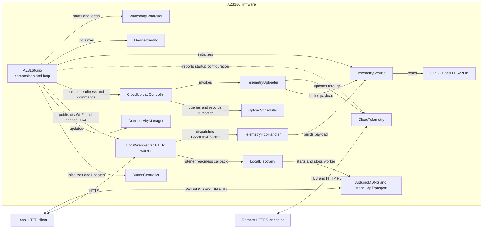
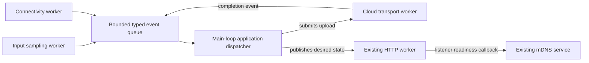

# AZ3166 Firmware Design

Status: current implementation as of 2026-09-13.

## 1. Scope

This document describes only the firmware that runs on the MXCHIP AZ3166. It
covers sensor acquisition, local HTTP telemetry, mDNS discovery, cloud upload, connectivity,
buttons, scheduling, watchdog behavior, platform compatibility fixes, and
firmware tests.

The implementation under `server/`, including ingestion, persistence,
dashboard, deployment, and operations, is outside the scope of this document.
The remote service appears here only as an HTTPS boundary used by the device.

## 2. Design Goals

- Expose current sensor readings over the local network.
- Keep a stable local hostname despite Wi-Fi reconnects and IPv4 address changes.
- Upload the same telemetry shape to a configured HTTPS endpoint.
- Recover from Wi-Fi loss and delayed time synchronization without rebooting.
- Keep scheduling policy separate from transport and sensor code.
- Avoid Arduino `String` construction in the telemetry path.
- Bound application-owned buffers and reject truncated or invalid payloads.
- Keep hardware and network boundaries replaceable in focused tests.
- Use the hardware watchdog as recovery for unexpectedly long blocking calls.

## 3. System Context



Arrows inside the firmware boundary represent direct calls or dependencies.
`ConnectivityManager` and `LocalWebServer` do not reference each other:
`AZ3166.ino` publishes current Wi-Fi state and the cached IPv4 address to
`LocalWebServer::update()`. A callback supplied by the sketch connects the HTTP
worker's listener readiness to `LocalDiscovery::update()`. Neither the HTTP
engine nor the discovery controller owns Wi-Fi policy. For cloud upload, the
composition root passes button
commands and the current Wi-Fi/time readiness state to `CloudUploadController`.
The controller owns the due check, one upload attempt, result classification,
and scheduler update. Constructor-only wiring is omitted from the diagram.

The main firmware uses a cooperative loop. Modules expose small synchronous
operations; `AZ3166.ino` owns their construction and decides when each operation
runs. Local HTTP and mDNS use separate bounded RTOS workers. HTTP dispatch does
not wait for a cloud POST to finish, and a slow HTTP client cannot block mDNS
queries. Short mutexes protect the HTTP connectivity snapshot, sensor acquisition,
and mDNS responder lifecycle; no network request holds the sensor mutex.

## 4. Source Organization

The production Arduino sketch root is `firmware/AZ3166/`. Arduino-recursive
production sources are grouped by capability under `src/`:

```text
src/
  config/
  connectivity/
  http/
  discovery/
    mdns/
  telemetry/
  cloud/
  input/
  platform/
```

Headers stay beside their implementations. `http/` contains only the reusable
HTTP engine and handler interface; the application-specific HTTP adapter lives
in `telemetry/`. `cloud/` owns transport and upload coordination. `platform/`
holds device identity, watchdog support, and the SDK compatibility overrides.
The vendored responder, metadata, and license stay together in `discovery/mdns/`.
`config/` holds `AppConfig.h`, the cloud configuration loader, the public root
certificate, deployment templates, and ignored local overrides. These remain
separate from the reusable implementation in `cloud/`. The Arduino sketch stays
at the sketch root and loads cloud overrides before application settings.

Production and test sketches use explicit `src/<capability>/...` include paths.
Sources include sibling headers by filename and other components through
relative paths, so no extra component directories are needed in global compiler
or IntelliSense include search paths. The existing editor roots remain valid.
Focused test sketches and staging scripts live separately under `firmware/tests/`.

| Area | Files | Responsibility |
| --- | --- | --- |
| Composition | `firmware/AZ3166/AZ3166.ino` | Creates long-lived objects, performs startup, and orchestrates the loop. |
| Configuration | `firmware/AZ3166/src/config/`: `AppConfig.h` and cloud headers | Owns application constants, the cloud configuration loader, trust anchor, templates, and ignored local overrides. |
| Device identity | `firmware/AZ3166/src/platform/DeviceIdentity.h/.cpp` | Derives and stores a stable identifier from the STM32 hardware UID. |
| Input | `firmware/AZ3166/src/input/ButtonDebouncer.h/.cpp`, `ButtonController.h/.cpp` | Converts active-low button samples into one-shot application events. |
| Watchdog | `firmware/AZ3166/src/platform/WatchdogController.h/.cpp` | Owns watchdog configuration, reset-cause reporting, enabled state, and timer feeds. |
| Connectivity | `firmware/AZ3166/src/connectivity/ConnectivityManager.h/.cpp` | Owns Wi-Fi reconnect policy, connection state, NTP retry, and connectivity events. |
| Sensor and JSON | `firmware/AZ3166/src/telemetry/TelemetryService.h/.cpp` | Stores an injected device ID pointer, owns and reads sensor objects, and formats the shared telemetry payload. |
| Local HTTP | `firmware/AZ3166/src/http/LocalWebServer.h/.cpp`, `LocalHttpHandler.h` | Owns the nonblocking lwIP listener, dedicated worker, bounded HTTP protocol, synchronized status, and optional service-lifecycle callback. |
| Telemetry HTTP adapter | `firmware/AZ3166/src/telemetry/TelemetryHttpHandler.h/.cpp` | Implements the application route and JSON/status mapping using its injected payload builder. |
| Local discovery | `firmware/AZ3166/src/discovery/`: `LocalDiscovery`, `MdnsTransport`, `MdnsUdpTransport`, vendored ArduinoMDNS | Owns discovery lifecycle, bounded multicast transport, and the synchronized background responder. |
| Upload workflow | `firmware/AZ3166/src/cloud/CloudUploadController.h/.cpp` | Gates attempts, translates upload outcomes into scheduling policy, and records completion-time results. |
| Upload coordination | `firmware/AZ3166/src/cloud/TelemetryUploader.h/.cpp` | Builds one payload and forwards its exact bytes and length to cloud transport. |
| Upload policy | `firmware/AZ3166/src/cloud/UploadScheduler.h/.cpp` | Decides when scheduled, retry, and manual uploads are due. |
| Upload result | `firmware/AZ3166/src/cloud/TelemetryUploadResult.h` | Carries typed upload status and the underlying network or HTTP detail code. |
| HTTPS transport | `firmware/AZ3166/src/cloud/CloudTelemetry.h/.cpp` | Builds the authenticated HTTPS request and classifies the response. |
| Core compatibility | `firmware/AZ3166/src/platform/FloatFormatting.cpp` | Replaces the defective AZ3166 Core `dtostrf` implementation. |
| SDK behavior | `firmware/AZ3166/src/platform/disable_system_telemetry.cpp` | Replaces SDK system telemetry hooks with no-op definitions. |

### 4.1 Injected Operations Interfaces

The platform-operation types are abstract interfaces with pure virtual methods
and virtual destructors. Their original names and operation signatures are
retained:

| Interface | Consumer | Default implementation |
| --- | --- | --- |
| `ConnectivityOperations` | `ConnectivityManager` | `Az3166ConnectivityOperations` |
| `LocalDiscoveryOperations` | `LocalDiscovery` | `Az3166LocalDiscoveryOperations` |
| `LocalWebServerOperations` | `LocalWebServer` | `Az3166LocalWebServerOperations` |
| `CloudTelemetryOperations` | `CloudTelemetry` | `Az3166CloudTelemetryOperations` |

Each consumer stores a non-owning, non-const reference to its injected backend.
It does not copy, allocate, or delete that backend, and a temporary backend
cannot be passed to the injected constructor. The caller must keep the backend
and any state it borrows alive until the consumer is destroyed. For HTTP, that
includes the worker shutdown and join performed by the server's destructor.

The convenience constructors still select internal, process-lifetime AZ3166
adapters. Selecting these implementations requires no heap allocation or RTTI.
The adapters call the same platform APIs as before; the discovery default still
uses one shared mDNS responder per device, not one responder per controller.

Interfaces allow stateful implementations and independent test fixtures, but do
not provide synchronization. HTTP's `currentTime()` may be called by both the
main loop and HTTP worker; its socket methods run on the worker and must retain
the nonblocking contract. Stateful injected backends must synchronize shared
state as appropriate. Connectivity and cloud calls remain synchronous.

Single-function hooks remain callbacks, including upload clocks, payload
builders, cloud response handlers, and the typed HTTP service notification.
`LocalHttpHandler` and `MdnsTransport` were already interfaces and are unchanged.

## 5. Startup and Main Loop

### 5.1 Startup

`setup()` performs the following sequence:

1. Starts serial output at 115200 baud and waits for the serial interface.
2. Reads the three STM32 UID words and formats the device ID.
3. Initializes both active-low buttons and their debounce state.
4. Reports a prior watchdog reset, then configures a 30-second watchdog.
5. Initializes the HTS221 temperature/humidity sensor and LPS22HB pressure
  sensor owned by `TelemetryService`.
6. Reports whether cloud upload has a usable device API key.

Wi-Fi connection is not performed in `setup()`. The first
`ConnectivityManager::update()` call in `loop()` starts the initial connection
attempt, allowing startup responsibilities to remain separate from ongoing
connection maintenance.

If device ID initialization fails, the firmware logs the error and continues.
Subsequent payloads use `az3166-FFFFFFFFFFFFFFFFFFFFFFFF` until the device is
restarted with successful initialization.

### 5.2 Loop Order

Each `loop()` iteration performs work in this order:

1. Reset the watchdog.
2. Update button state and apply upload or pause events.
3. Reset the watchdog.
4. Update Wi-Fi, local IPv4 address, and time synchronization state.
5. Report new connectivity and local address events.
6. Reset the watchdog.
7. Publish Wi-Fi state and the cached IPv4 address to the HTTP worker. The worker
  owns listener reconciliation, advertisement callbacks, and client handling.
8. Reset the watchdog.
9. Pass current Wi-Fi/time readiness to `CloudUploadController`.
10. If configured and due, the controller performs one upload and records its
  result using the completion timestamp.

Cloud upload requires all of the following conditions:

- Wi-Fi is connected.
- System time is synchronized.
- The cloud API key is configured.
- `UploadScheduler` reports that an upload is due.

`AZ3166.ino` supplies only the first two conditions. The controller checks
configuration through `TelemetryUploader` and owns the scheduler transaction.

Time synchronization is a cloud gate because TLS certificate validation
depends on a valid clock. Local HTTP telemetry requires Wi-Fi but does not
require synchronized time or cloud configuration.

## 6. Connectivity Design

`ConnectivityManager` is the only application module that calls `WiFi.begin`,
`WiFi.disconnect`, `WiFi.status`, `SyncTime`, and `IsTimeSynced`. It also owns
local IPv4 reads through `WiFiInterface()->get_ip_address()`.

### 6.1 Wi-Fi State and Retry

- The first update attempts a connection immediately.
- Every attempt calls `WiFi.disconnect()` before `WiFi.begin()` so the AZ3166
  station state is reset before reconnecting.
- Failed attempts use exponential delays of 5, 10, 20, 40, and then 60 seconds.
- The retry delay remains capped at 60 seconds.
- While connected, physical status is checked once per second.
- A detected disconnect clears both Wi-Fi and time-synchronized state and emits
  `wifiDisconnected`.
- Reconnection starts on a later loop iteration; a successful attempt emits
  `wifiConnected`.

The retry timestamps are captured after blocking platform calls complete. This
means a retry interval starts when an attempt finishes, not when it begins.
Unsigned `millis()` subtraction is used so interval checks remain valid across
counter wraparound.

### 6.2 Time Synchronization

After Wi-Fi connects, the manager checks whether the platform already has
synchronized time. If it does not, NTP synchronization is retried every 60
seconds. Losing Wi-Fi also clears the cached synchronized state.

`ConnectivityOperations` is an abstract interface for current time, Wi-Fi, local
IPv4 address reads, and NTP operations. Its seven methods are pure virtual, with
a virtual destructor; the original type and operation names are retained.

The four-argument `ConnectivityManager` constructor uses an internal
`Az3166ConnectivityOperations` implementation with process lifetime, forwarding
to the same AZ3166 platform functions. The injected constructor accepts a
non-const `ConnectivityOperations&` and stores a non-owning reference, not a
copy. The supplied implementation must outlive the manager; the manager neither
allocates nor deletes it. Implementations can own their state without global
test variables, and selecting a backend requires no heap allocation or RTTI.

Tests derive a stateful fake from the interface and construct it before each
manager. Clocks, connection results, addresses, and call counters belong to each
fake instance. The interface changes dependency injection only: Wi-Fi/NTP calls
remain synchronous, the state machine is unchanged, and no thread safety is
implied by virtual dispatch.

### 6.3 Local IPv4 State

`localIPv4Address()` returns a cached `uint32_t`, with the first address octet in
the most significant byte: `192.0.2.1` is represented as `0xC0000201`. Zero means
no address is currently recorded. The getter does not access the network stack.

The platform adapter treats a null interface or null/invalid address text as
unavailable. It guards the SDK parser rather than using `WiFi.localIP()`, whose
Core 2.0.0 implementation can pass a null interface address to that parser.

- Read the address after each successful Wi-Fi connection and during the
  existing one-second status checks while Wi-Fi remains connected.
- Emit `localAddressChanged` for one update whenever the cached value changes,
  including initial acquisition, replacement, and loss of an address.
- Clear the address on disconnection. Do not read a potentially stale platform
  address during failed connection attempts or retry backoff.
- Allow Wi-Fi to be connected before an address is assigned. Later acquisition
  or loss of an address does not itself change Wi-Fi or NTP readiness.
- A reconnection reads the address again, even when DHCP returns the same value
  used before disconnection.

The sketch reports the current HTTP endpoint after a connection or address
change, but only when Wi-Fi is connected and the cached address is nonzero.
Address tracking does not change cloud upload gating or local HTTP handling.

### 6.4 Local mDNS Discovery

The fixed host label is `az3166`, advertised as `az3166.local`. The local URL is
`http://az3166.local/api/telemetry`; the existing HTTP API and cloud identity do
not change. The initial version assumes a single device using that name per LAN
and does not implement custom collision resolution or automatic renaming.

`LocalDiscovery::update(serviceAvailable, address)` is called only by the HTTP
worker's lifecycle callback. `serviceAvailable` means the listener successfully
opened, bound, and started listening for the current connectivity generation.
Wi-Fi alone does not trigger advertisement. NTP synchronization, cloud
configuration, and upload state are not required:

- Start once after a listener is ready on a usable address.
- Leave the responder running while the address and Wi-Fi state are unchanged.
- Stop and release the socket and service/name allocations when the listener
  stops, including address loss, disconnect, or listener failure; restart and
  announce on reconnection, even with the same address.
- Replace the responder and multicast binding when a connected address changes.
- Retry startup or detected transport failure after five seconds, measured from
  completion. A new address bypasses the previous address's retry delay.
- Discovery failures do not reset Wi-Fi or disable direct-IP HTTP or cloud work.

ArduinoMDNS 1.0.1 supplies DNS encoding, query handling, and service registration.
The source is vendored with its LGPL notices and local compatibility fixes; the
installed AZ3166 board package is not modified. Its native mDNS header
declarations do not provide linkable responder implementations in Core 2.0.0.

`LocalDiscoveryService` supplies borrowed, process-lifetime hostname, service
name, port, and TXT metadata; the controller no longer includes `AppConfig` or
hard-codes telemetry. This application's descriptor publishes the current IPv4
A record and an `_http._tcp.local.` service on the matching HTTP port with TXT
`path=/api/telemetry`. The current platform backend has one responder per device.
Address and unique service records carry cache-flush and a 120-second TTL.
Registration announces immediately, a worker sends a follow-up after one second,
and the library refreshes services every 90 seconds. Service goodbye records are
best effort; cached names can remain until their TTL expires after link loss.

The worker is created once, uses a fixed 4096-byte stack, services at most one
received datagram every 20 milliseconds, and does not access sensors or mutate
connectivity state. The HTTP worker and mDNS worker serialize responder access
with a mutex. Multicast UDP uses port 5353 and `224.0.0.251` on the current IPv4 interface,
nonblocking sockets, a 1536-byte receive buffer, and a 512-byte send buffer.
Oversized packets are discarded rather than passed partially to the parser.

This is an IPv4 LAN responder, not router DNS registration or a `.local` client
resolver. Clients must support IPv4 mDNS and multicast must reach the device.
VLAN boundaries, AP isolation, VPN policy, or a DNS-only resolver can prevent
name-based access even when direct-IP HTTP works. Discovery adds no encryption
or authentication to local HTTP.

## 7. Device Identity

`DeviceIdentity` reads three 32-bit UID words from STM32 address `0x1FFF7A10`
and produces this stable format:

```text
az3166-<UID0:8HEX><UID1:8HEX><UID2:8HEX>
```

The output is 31 characters plus the null terminator, matching
`DeviceIdentity::DEVICE_ID_SIZE == 32`. The generated value contains only the
fixed prefix and uppercase hexadecimal characters, so it can be inserted into
the current JSON payload without an escaping step.

The process-lifetime `DeviceIdentity` instance owns the ID buffer and its
initialized state. Before a successful `begin()`, `get()` returns the stable,
full-width fallback `az3166-FFFFFFFFFFFFFFFFFFFFFFFF`; afterward it returns the
generated ID. `AZ3166.ino` passes that process-lifetime string pointer to
`TelemetryService::begin()`. `TelemetryService` therefore has no dependency on
the identity type. Local HTTP and cloud upload callers then request a payload
without carrying the identity through their polling or upload APIs. The pure
`formatPayload(deviceId, reading, ...)` function retains an explicit identity
argument for deterministic formatting tests.

## 8. Telemetry Pipeline

Both local responses and cloud uploads use the same entry point:

```text
TelemetryService::buildPayload
    -> TelemetryService::read
    -> TelemetryService::formatPayload
```

The sensor read succeeds only when all three driver calls return zero:

- HTS221 temperature
- HTS221 relative humidity
- LPS22HB pressure

HTTP and cloud callers may build payloads concurrently. `TelemetryService::read`
serializes the three sensor driver calls with an instance-owned mutex, then
releases it before formatting or network I/O. Each caller has its own reading
and response/payload storage. `begin()` must complete before the HTTP worker
starts; device identity and sensor initialization are not mutated afterward.

The emitted JSON shape is:

```json
{
  "deviceId": "az3166-00112233445566778899AABB",
  "temperature": 23.5,
  "humidity": 45.0,
  "pressure": 1013.2
}
```

All measurements are JSON numbers with exactly one decimal digit. Before
formatting, readings are checked against the ingestion contract: temperature
must be -50 to 100 degrees Celsius, humidity 0 to 100 percent, and pressure
300 to 1200 hPa. Cloud upload uses a fixed 160-byte payload buffer; the generic
HTTP engine supplies its own 512-byte response buffer. Both use the same formatter.
`buildPayload()` returns the byte length on success and one of these negative
errors on failure:

| Result | Meaning |
| --- | --- |
| `PAYLOAD_SENSOR_ERROR` | A sensor driver read failed, or a reading was non-finite or outside the ingestion range. |
| `PAYLOAD_FORMAT_ERROR` | An argument, conversion, or output capacity was invalid. |

Reading validation rejects `NaN`, infinity, and out-of-range measurements as
transient sensor failures. Formatting rejects `dtostrf` overflow and
`snprintf` truncation. Callers send only a positive length strictly smaller
than the buffer capacity.

## 9. Local HTTP Interface

### 9.1 Worker and Listener Ownership

`LocalWebServer` is a reusable HTTP engine with an injected `LocalHttpHandler`
and an optional typed `LocalHttpServiceUpdate` callback. It does not include
`AppConfig`, know the telemetry schema, or depend on discovery. The application
selects port 80 and supplies `TelemetryHttpHandler` plus its mDNS callback.

`LocalHttpServiceUpdate` is `mbed::Callback<void(bool, uint32_t)>`. The sketch
binds `LocalDiscovery::update` directly with `mbed::callback`, eliminating the
raw context pointer and forwarding wrapper. The server stores the callback by
value; an empty callback is allowed. Copying a callback does not transfer
ownership of its bound object or provide synchronization for that object.

`update(wifiConnected, address)` publishes a mutex-protected desired state and
starts one normal-priority RTOS worker when an address first becomes available.
It does not poll clients or perform network I/O in the main loop. The worker
uses a 6144-byte stack allocated at startup and is reused across reconnects.

- Only the HTTP worker creates, accepts, reads, writes, and closes HTTP sockets.
- Startup uses lwIP `socket`, `bind`, and `listen` results directly, avoiding the
  Core `WiFiServer::begin()` wrapper's silent failures. A successful listener is
  not reopened periodically. This reports socket readiness, not a guarantee of
  network reachability.
- Startup and accept failures retry at a bounded five-second interval, measured
  from completion. A new requested address resets the retry delay.
- A generation counter detects address changes and disconnect/reconnect pairs,
  even if Wi-Fi returns to the same address before the next worker iteration.
- An outdated startup result is closed without advertisement. Active I/O checks
  the generation and aborts when connectivity changes; the main thread never
  closes sockets that the worker owns.
- `state()` returns worker startup, listener readiness, bound address, and the
  last lifecycle error. A changed connectivity request immediately clears
  published listener readiness while the worker performs cleanup.
- The optional service callback runs on the worker, outside the state mutex,
  after successful listener startup and while it remains ready. It receives an
  unavailable state before listener shutdown or replacement. This permits mDNS
  startup retries without depending on main-loop progress.
- Destruction requests worker shutdown and joins it, closing remaining sockets.
  Handler and callback dependencies must outlive the worker; neither may destroy
  the server from its own thread. The handler must finish before shutdown can
  complete.

### 9.2 Protocol and Application Handler

`TelemetryHttpHandler` owns the application's routing contract, recognizing only
a request line beginning with:

```http
GET /api/telemetry 
```

The trailing space is part of the match and separates the path from the HTTP
version. Other methods and paths are not routed to telemetry.

The HTTP worker handles one client at a time, using nonblocking socket readiness
checks and short RTOS waits when I/O cannot progress:

- Request-line storage is fixed at 96 bytes.
- Header reading ends at the first blank line, with a total limit of 2048 bytes.
  Overlong request lines and embedded NUL bytes are rejected rather than truncated.
- Header reading and response writing each have a two-second deadline, checked
  with wraparound-safe elapsed-time arithmetic. A slow client does not hold a
  sensor or shared state lock.
- `LocalHttpHandler::handle()` receives the request line and a 512-byte response
  buffer, and returns status, content type, and exact body byte count. Application
  handlers can return text or binary data; returned metadata strings must remain
  valid until the response is sent. Handler work itself must be bounded.
- Telemetry uses `application/json`; custom handlers can choose other types.
  Every response has an explicit `Content-Length` and `Connection: close`.
- Partial writes are completed within the response deadline. Invalid body bounds
  or null metadata produce a bounded `500` response.
- Request bodies, persistent connections, and WebSockets are not implemented.
- Responses are logged by status after transmission, without HTTP payload logging.
- The client connection is closed after one response.

| Condition | HTTP status | Body |
| --- | --- | --- |
| Valid telemetry request | `200 OK` | Current telemetry JSON |
| Incomplete, empty, or timed-out request | `400 Bad Request` | `{"error":"bad request"}` |
| Unknown route | `404 Not Found` | `{"error":"not found"}` |
| Sensor read failure or invalid reading | `503 Service Unavailable` | `{"error":"sensor read failed"}` |
| Payload formatting failure | `500 Internal Server Error` | `{"error":"payload formatting failed"}` |
| Invalid handler metadata or body bounds | `500 Internal Server Error` | `{"error":"invalid response"}` |

The local interface is plain HTTP and has no application authentication. Its
security boundary is therefore the network to which the AZ3166 is connected.

## 10. Cloud Upload

Cloud upload is split into four responsibilities:

1. `CloudUploadController` owns readiness gating and the complete attempt/result
  workflow.
2. `UploadScheduler` decides whether an attempt is due and stores timing state.
3. `TelemetryUploader` builds and validates one payload.
4. `CloudTelemetry` owns HTTPS request and response classification.

### 10.1 Scheduling

The scheduler begins with a zero delay, so the first upload is due as soon as
all cloud gates are ready.

| Previous result or action | Next behavior |
| --- | --- |
| Successful upload | Wait 5 minutes from completion. |
| Sensor, network, HTTP 408/422/425/429, or HTTP 5xx failure | Retry 15 seconds after completion. |
| Invalid payload, disabled dependency, or non-retryable HTTP response | Suppress scheduled uploads. |
| Button A | Queue an immediate manual upload. |
| Button B pauses | Suppress scheduled uploads. |
| Button B resumes | Clear the delay so a scheduled upload is immediately due unless non-retryable suppression is active. |

Pause applies only to scheduled uploads. A manual upload remains eligible while
paused. A retryable manual failure remains pending and follows the 15-second
retry interval. A non-retryable result clears the manual request and suppresses
automatic attempts; a new manual request can probe recovery, and a successful
manual upload restores normal scheduling.

`CloudUploadController` reads the clock again after synchronous upload returns.
Intervals therefore start when the attempt completes, preventing a slow TLS
request from consuming the retry delay and causing an immediate next attempt.

### 10.2 Payload Coordination

`TelemetryUploader` owns a stack buffer of
`AppConfig::TELEMETRY_PAYLOAD_SIZE`, invokes the configured payload builder
once, rejects non-positive or oversized lengths, and forwards the exact byte
count to `CloudTelemetry`.

Production `TelemetryUploader` holds the shared `TelemetryService` instance and
calls its `buildPayload()` method. Tests can instead supply a
`TelemetryPayloadBuildFunction`, preserving deterministic coordination tests
without sensor access.

### 10.3 HTTPS Contract

`CloudTelemetry` creates one synchronous `HTTPClient` POST request with:

- the configured root CA certificate;
- `Content-Type: application/json`;
- `Accept: application/json`;
- `X-Device-Key: <configured key>`;
- `Connection: close`;
- the explicit payload pointer and byte length.

An API key is considered configured only when it is non-null, contains at
least 32 characters, and differs from the configured placeholder. The API key
is not included in telemetry JSON or serial request logging.

Only HTTP `201` is considered a successful upload. Network failures retain the
platform error code. HTTP `408`, `422`, `425`, `429`, and `5xx` responses are
classified as retryable; every other non-201 response is classified as
rejected. Treating `422` as retryable is a defense in depth: production
firmware rejects known out-of-range sensor readings locally, but a server-side
validation response must not permanently suppress scheduled uploads. HTTP
status codes are retained as result detail, and a non-success response body is
written to serial output when present.

`CloudTelemetryOperations` provides an injectable `send()` method. The consumer
borrows the backend by reference; a missing implementation is rejected by the
abstract interface rather than represented by a null function pointer. A
backend that cannot send must return a typed failure or disabled result.

`send()` remains synchronous: request pointers are borrowed for the duration of
the call, and any invocation of the supplied `CloudTelemetryResponseHandler`
must occur while the response body is still valid. Request validation and
response classification are unchanged. Tests inject stateful backends so each
instance has its own captured request, response, and call count without using
the real TLS transport.

## 11. Button Input

AZ3166 user buttons are active-low and sampled from the main loop.

| Button | Event | Behavior |
| --- | --- | --- |
| A | `uploadRequested` | Queue an immediate cloud upload when cloud credentials are configured. |
| B | `toggleUploadPause` | Toggle scheduled cloud uploads between paused and active. |

Each button has an independent `ButtonDebouncer` with a 50 ms stable interval.
It emits one event only when a new press becomes stable. Holding a button does
not repeat the event. A button already held during startup is captured as the
initial state and must be released before a later press can emit an event.

## 12. Watchdog and Blocking Behavior

The hardware watchdog is configured for 30 seconds. It is reset around the
major loop phases and immediately before a cloud upload.

The firmware is cooperative but not fully non-blocking. These platform or
protocol operations may block the loop:

- `WiFi.begin()` during a connection attempt;
- `SyncTime()` during an NTP attempt;
- local request reading, bounded by 2 seconds;
- `HTTPClient::send()` during DNS, TCP, TLS, request, and response processing.

The watchdog is the final recovery boundary if a platform call does not return
within its timeout. It does not cancel an operation or provide a per-operation
timeout. A watchdog reset is reported on the next startup.

## 13. Memory and Formatting Strategy

Application-owned telemetry construction uses fixed buffers:

- 160 bytes for the complete telemetry JSON;
- 16 bytes for each one-decimal measurement;
- 96 bytes for the local HTTP request line;
- 32 bytes for the device ID.

The telemetry path does not use Arduino `String` concatenation. JSON is formed
with one bounded `snprintf`, and the resulting explicit length is passed to the
HTTPS layer. Platform libraries such as `HTTPClient` may still allocate memory
internally.

### 13.1 `dtostrf` Core Override

The AZ3166 C library does not reliably support `%f` in the `printf` family, so
Arduino uses `dtostrf` for float-to-text conversion. AZ3166 Core 2.0.0 has a
defect in its `dtostrf` implementation: it may append an extra fractional digit,
for example formatting `45.0` at precision 1 as `45.00`.

`FloatFormatting.cpp` defines the same `extern "C"` function signature. Sketch
objects are linked before the Core archive, so this project definition satisfies
`dtostrf` references before the defective archive member is selected. The board
package remains unmodified.

The replacement preserves the expected Arduino behavior for:

- `nan`, `inf`, and `ovf` markers;
- positive and negative values;
- decimal precision and rounding;
- right alignment for positive width;
- left alignment for negative width.

Because the symbol is global, Core code such as `String(float)` also resolves to
the fixed implementation, although the telemetry path avoids `String`.

### 13.2 SDK System Telemetry Override

`disable_system_telemetry.cpp` supplies no-op C definitions for the SDK system
telemetry hooks. This prevents the bundled SDK telemetry callbacks from sending
unrelated system telemetry while leaving application telemetry under explicit
firmware control.

## 14. Configuration and Credentials

Current application constants are centralized in
`firmware/AZ3166/src/config/AppConfig.h`:

| Setting | Value |
| --- | --- |
| Local telemetry path | `/api/telemetry` |
| Local HTTP port | 80 |
| Local HTTP startup retry | 5,000 ms |
| Telemetry payload capacity | 160 bytes |
| Normal cloud interval | 300,000 ms |
| Failed-upload retry | 15,000 ms |
| Wi-Fi status interval | 1,000 ms |
| Wi-Fi retry range | 5,000 to 60,000 ms |
| NTP retry interval | 60,000 ms |
| Button debounce interval | 50 ms |
| Watchdog timeout | 30,000 ms |

The public HTTPS endpoint defaults to `telemetry.example.com`, and a clean
checkout disables uploads by using a placeholder key. A deployment can override
the endpoint through the ignored `firmware/AZ3166/src/config/cloud_deployment.h` and the
device key through the ignored `firmware/AZ3166/src/config/cloud_secrets.h`; corresponding
`.example.h` files are committed as templates. The root CA is compiled from
`firmware/AZ3166/src/config/cloud_ca.h`. The loader and its optional override
headers share that directory, so sibling-header lookup is preserved. Credentials
must not be printed, committed, or
included in test fixtures.

## 15. Error and State Invariants

- Sensor data is never sent when any required sensor read fails.
- Non-finite, out-of-range, overflowing, or truncated telemetry is never sent.
- Local and cloud telemetry share the same sensor and JSON implementation.
- Cloud transport is never entered without Wi-Fi, synchronized time, configured
  credentials, and a due scheduler state.
- Every attempted cloud upload records a typed result at its completion time.
- Wi-Fi loss invalidates synchronized-time state and stops local HTTP after the
  disconnect is detected.
- Retryable failures use the short delay; non-retryable failures suppress
  scheduled attempts until a successful manual recovery.
- The API key stays in the HTTPS header and never enters the telemetry payload.
- `millis()` interval checks use unsigned subtraction for wraparound safety.

## 16. Firmware Test Design

Firmware tests live under `firmware/tests/` and use small Arduino sketches. The
shared `firmware/tests/Az3166TestHarness.ps1` stages only each suite's required
files from `firmware/AZ3166/src/`. Tests can be compiled independently or
run on the target; target execution waits for a suite-specific marker and an
explicit pass/fail result.

All eleven suite runners use `StageSourcesUnderSrc`. Each entry in `SourceFiles`
is relative to the production source root, and the harness preserves that path
inside the staged sketch's `src/` tree instead of flattening individual files.
Only selected dependencies are copied, including the whole `discovery/mdns/`
subtree for discovery tests. Suites that need application constants select
`config/AppConfig.h` individually; they do not copy private cloud overrides or
the entire `config/` directory. This keeps cross-component includes identical in
production and tests and allows Arduino to compile nested sources recursively.

| Suite | Primary coverage |
| --- | --- |
| `ButtonDebouncerTests` | Stable transitions, bounce, holds, startup state, and `millis()` wraparound. |
| `ButtonControllerTests` | Button-to-event mapping, simultaneous events, and active-low behavior. |
| `DeviceIdentityTests` | UID formatting, padding, invalid buffers, uninitialized fallback, internal storage, hardware initialization, and configured sizes. |
| `TelemetryServiceTests` | Identity injection, JSON shape, rounding, ingestion-range validation, buffer errors, `dtostrf` regression, and onboard sensors. |
| `LocalWebServerTests` | Interface contract and independent backends, application response mapping, actual RTOS worker execution, listener readiness/retries, stale startup, reconnects, partial I/O, binary responses, bounds, deadlines, and cleanup. |
| `LocalDiscoveryTests` | Interface contract and independent backends, caller-supplied metadata, address lifecycle, retry timing, worker failure recovery, A/AAAA responses, service records, malformed queries, transport bounds, and repeated cleanup. |
| `UploadSchedulerTests` | Initial upload, typed outcomes, pause, manual upload, retry, non-retryable suppression, recovery, and wraparound. |
| `CloudTelemetryTests` | Interface contract and independent backends, API-key validation, request fields, typed network/HTTP outcomes, HTTP 201 success, and HTTP 422 retry. |
| `CloudUploadControllerTests` | Readiness gates, pause/manual behavior, completion-time retry, HTTP 422 automatic recovery, non-retryable suppression, and manual recovery. |
| `ConnectivityManagerTests` | Interface contract, independent injected instances, retry progression, blocking-attempt timing, IPv4 parsing and changes, disconnect/reconnect, NTP retry, and wraparound. |
| `TelemetryUploaderTests` | Builder invocation, exact bytes and length, build failures, bounds, missing dependencies, and transport failure. |

Tests use small interfaces and single-function callbacks rather than a general
mocking framework:

- `ConnectivityOperations` is an injected interface replacing clock, Wi-Fi,
  address reads, and NTP calls with instance-owned fake state.
- `LocalWebServerOperations` injects clock and nonblocking socket behavior while
  tests run the real worker. Each fake backend binds a fixture and its mutex and
  semaphores; separate instances can drive separate workers. Large packet buffers
  remain in static test storage rather than on the embedded test stack.
- `TelemetryHttpPayloadBuilder` replaces telemetry acquisition in HTTP response-contract tests.
- `LocalDiscoveryOperations` injects clock, responder startup/shutdown, and health
  checks through a stateful fake implementation.
- `MdnsTransport` lets protocol tests capture datagrams without using real Wi-Fi.
- `CloudTelemetryOperations` injects HTTPS send behavior into transport, uploader,
  and upload-controller tests. Test backends are constructed before their consumers.
- `CloudUploadClock` replaces the controller clock.
- `TelemetryPayloadBuildFunction` replaces sensor and payload construction.
- Pure or state-only entry points cover routing, scheduling, debouncing,
  identity formatting, and telemetry formatting.

## 17. Current Constraints

- The firmware serves one local client at a time.
- Local HTTP is unauthenticated and unencrypted.
- Wi-Fi, NTP, and HTTPS platform calls are synchronous.
- HTTP and mDNS are independent of cloud waits, but buttons and connectivity
  maintenance still run in the main loop and can wait for a synchronous upload.
  The watchdog is still fed by that loop; arbitrary blocking HTTP handlers are
  not independently recovered by a worker watchdog.
- Scheduling state is held only in RAM and resets on reboot.
- A telemetry operation performs one sensor-read attempt; it has no internal
  sensor retry loop.
- The generated hardware device ID is safe for direct JSON insertion, but the
  public formatter does not escape an arbitrary caller-supplied device ID.
- Serial logging includes telemetry payloads and failed HTTP response bodies;
  deployments should treat serial access as operationally sensitive.

## 18. Future Direction: Event-Driven Coordination

Status: proposed, not implemented. The preceding sections describe the current
firmware. Today, the main loop polls buttons and connectivity, handles the
returned events directly, and performs cloud uploads synchronously. HTTP and
mDNS already have independent workers; there is no application event queue.

The proposed direction separates event producers from one application-level
dispatcher. Producers publish typed messages to a bounded RTOS queue, and the
main loop consumes them to apply application policy and coordinate services.

### 18.1 Execution and Ownership



| Component | Proposed responsibility |
| --- | --- |
| Input worker | Sample and debounce inputs, then report input facts without deciding which application action to perform. |
| Connectivity worker | Remain the sole owner of Wi-Fi reconnect and NTP policy, and publish connectivity state changes. |
| Main-loop dispatcher | Map events to application actions, maintain upload scheduling, and publish desired service state using short, bounded operations. |
| Cloud transport worker | Own the HTTPS transaction for a submitted payload and return its result and completion time; allow at most one upload in flight. |
| Existing HTTP and mDNS workers | Retain ownership of their sockets and execution, with advertisement still coordinated through listener readiness. |

The dispatcher must not wait for a cloud transaction to finish. Moving input
detection into a thread while leaving synchronous uploads in the consumer would
capture button presses sooner but still delay their actions and connectivity
handling. Cloud transport therefore needs an asynchronous submission/result
boundary for queued dispatch to achieve its responsiveness goal.

Input sampling must also remain independent of slow connectivity operations.
The current `ConnectivityManager::update()` can invoke synchronous Wi-Fi and
NTP calls. Running it in the same worker as button sampling could suspend input
polling for the duration of those calls. A shared producer thread is suitable
only if every operation it polls is bounded and quick.

The queue does not make shared objects thread-safe. Workers continue to own
their resources; cross-thread state needs copied messages or synchronized
snapshots. Preserve sensor acquisition locking, avoid concurrent access to an
active request object, and never hold a shared application lock across network
I/O. A cloud payload must remain owned and valid until its upload completes.

### 18.2 Event and Queue Contract

- Use tagged, typed events with small payloads copied by value or stored in a
  fixed, owned message pool. Do not enqueue pointers to temporary objects.
- Prefer input facts such as `ButtonAPressed` over application commands such as
  `uploadRequested`. The dispatcher decides that a button press requests an
  upload, keeping the input component reusable.
- Bound queue capacity, producer enqueue time, and dispatcher work per iteration.
  Define queue-full behavior before implementation; do not grow memory without
  limit or block input sampling indefinitely.
- Distinguish discrete actions from replaceable state. Preserve button presses
  where possible; coalesce repeated connectivity updates when only the newest
  state matters. Make overflow observable and do not silently lose completion
  messages needed to clear an in-flight operation.
- Include relevant captured state and a connection generation in connectivity
  events. Ignore superseded updates rather than restarting HTTP for an old
  connection. Generation changes must survive coalescing, including a disconnect
  and reconnect that return the same IP address.
- Carry completion timestamps with upload outcomes so retry timing remains based
  on transaction completion, not on when a delayed dispatcher reads the event.

### 18.3 Incremental Migration

Keep the current event-returning APIs until this architecture is needed. There
is no need to add callbacks to every component or introduce an event bus solely
to shorten the sketch. The current `handleButtonEvents` application policy and
`handleConnectivityEvents` reporting naturally become dispatcher handlers; their
responsibilities do not disappear when delivery moves through a queue.

Introduce the asynchronous cloud boundary before relying on the main loop as a
responsive queue consumer. Then adapt event producers and move application
dispatch into its own module, retaining independent HTTP and mDNS services.
Each step should remain separately reviewable and preserve existing behavior
until an explicit contract changes.

Before implementation, settle queue and stack budgets, event ordering and
overflow policy, disconnect coordination, transport timeouts/cancellation, and
worker health monitoring. A main loop that continues feeding the watchdog must
not hide a stuck cloud worker. Focused validation should cover input delivery
during network waits, queue saturation, stale generations, upload completion,
and worker recovery rather than assuming that additional threads guarantee
bounded latency.