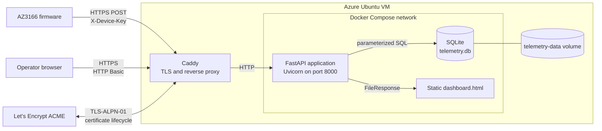
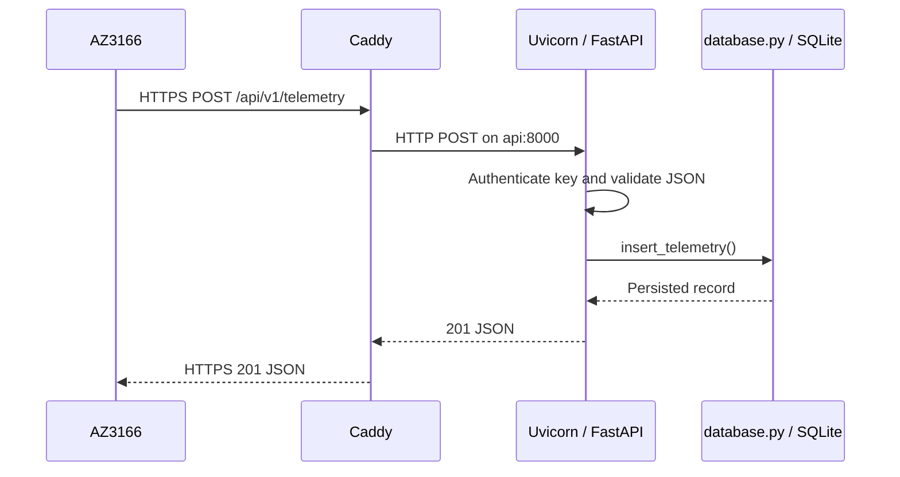
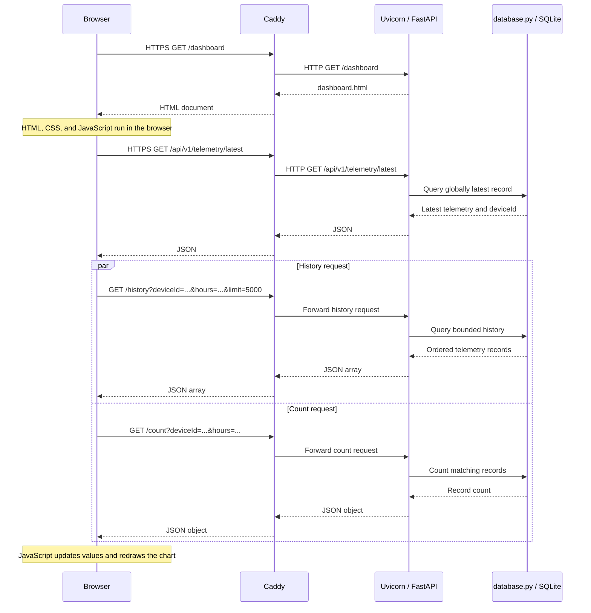

# HomeTemperature Server Design

Status: current implementation as of 2026-08-18.

## 1. Scope

This document describes the server under `server/`. It covers telemetry
ingestion, validation, authentication, persistence, query APIs, the browser
dashboard, TLS termination, container deployment, health checks, backup, and
server-side tests.

The AZ3166 firmware is outside this document's implementation boundary. The
device appears here only as an authenticated HTTPS client. Firmware internals
are described in `docs/firmware-design.md`.

## 2. Design Goals

- Accept the telemetry shape emitted by the AZ3166 firmware over HTTPS.
- Assign a trustworthy server-side UTC receipt time to every accepted sample.
- Keep device writes separate from operator and dashboard reads.
- Validate identifiers and sensor ranges before data reaches persistence.
- Preserve telemetry across container replacement with a mounted SQLite volume.
- Support the latest-reading and bounded-history queries needed by the current
  dashboard without introducing a separate frontend build system.
- Expose only TLS publicly; keep FastAPI and SQLite on the private container
  network or filesystem.
- Keep deployment small enough for one device reporting approximately once per
  minute while retaining a clear migration path if load grows.

## 3. System Context



Only Caddy publishes a host port, TCP 443. The API container exposes port 8000
only to the Compose network, and the SQLite database is a file in the named
`telemetry-data` volume. Caddy owns public TLS, compression, response security
headers, the request-body limit, and reverse proxying. FastAPI owns application
authentication, validation, routing, and response serialization.

The deployment is a single-instance design. There is one API service and one
Caddy service, with SQLite providing local durable storage. It does not attempt
horizontal API scaling, database replication, or high availability.

## 4. Source Organization

| Area | Files | Responsibility |
| --- | --- | --- |
| Application entry | `server/app/asgi.py` | Creates the production ASGI application from the application factory. |
| HTTP application | `server/app/main.py` | Defines models, authentication dependencies, routes, startup initialization, and dashboard serving. |
| Configuration | `server/app/settings.py` | Loads required secrets and the database path from environment variables. |
| Persistence | `server/app/database.py` | Owns schema initialization, transactions, inserts, queries, and row-to-API mapping. |
| Dashboard | `server/app/static/dashboard.html` | Implements the authenticated, dependency-free telemetry UI and canvas chart. |
| Python image | `server/Dockerfile`, `server/requirements.txt` | Builds and runs the FastAPI/Uvicorn application image. |
| Public edge | `server/Caddyfile` | Configures ACME TLS, proxying, compression, limits, headers, and access logs. |
| Runtime topology | `server/compose.yaml` | Wires containers, environment, health checks, volumes, capabilities, and log rotation. |
| Operations | `server/scripts/`, `server/DEPLOY.md`, `server/README.md` | Provides host bootstrap, deployment, backup, recovery, and maintenance guidance. |
| Tests | `server/tests/` | Verifies API contracts and database behavior against temporary SQLite files. |

## 5. Application Construction and Lifecycle

`create_app(settings=None)` is the composition root. Production calls it
without arguments, causing `Settings.from_environment()` to load configuration.
Tests inject a `Settings` instance so they do not depend on process secrets or
the production database path.

The application disables the generated OpenAPI document and both interactive
documentation endpoints. During FastAPI lifespan startup it calls
`initialize_database()` before serving requests. Startup creates the database
directory, table, and index if they do not already exist; schema creation is
idempotent. No application shutdown work is required because database
connections are scoped to individual operations.

Application uptime is measured from a monotonic timestamp captured when
`create_app()` runs. It therefore represents the age of the current application
process, not VM, container, or database uptime.

## 6. Configuration

The application has four settings:

| Environment variable | Required | Default | Purpose |
| --- | --- | --- | --- |
| `DATABASE_PATH` | No | `/data/telemetry.db` | SQLite database file used by all persistence operations. |
| `PUBLIC_HOST` | Compose | None | Public DNS hostname used by Caddy and ACME. |
| `DEVICE_API_KEY` | Yes | None | Shared secret accepted from devices in `X-Device-Key`. |
| `DASHBOARD_USERNAME` | Yes | None | HTTP Basic username for dashboard and read APIs. |
| `DASHBOARD_PASSWORD` | Yes | None | HTTP Basic password for dashboard and read APIs. |

Missing or empty required values raise `RuntimeError` during application
construction. Compose additionally requires all three secret variables and
`ACME_EMAIL` during configuration expansion, so an incomplete deployment fails
before containers start.

Secrets are injected at runtime and are not stored in the image. The deployment
expects them in a host-side `.env` file that is excluded from source control and
deployment archives.

## 7. HTTP API

### 7.1 Endpoint Summary

| Method | Path | Authentication | Success | Purpose |
| --- | --- | --- | --- | --- |
| `GET` | `/healthz` | Public | `200` | Liveness endpoint used by the container health check. |
| `POST` | `/api/v1/telemetry` | `X-Device-Key` | `201` | Validate and persist one device sample. |
| `GET` | `/api/v1/telemetry/latest` | HTTP Basic | `200` | Return the latest sample globally or for one device. |
| `GET` | `/api/v1/telemetry/history` | HTTP Basic | `200` | Return bounded history for one device and time window. |
| `GET` | `/api/v1/telemetry/count` | HTTP Basic | `200` | Count records for one device and time window. |
| `GET` | `/api/v1/status` | HTTP Basic | `200` | Return process and aggregate database status. |
| `GET` | `/`, `/dashboard` | HTTP Basic | `200` | Serve the static dashboard document. |

There is no public device-list endpoint. When a query omits `deviceId`, the
application first finds the globally latest inserted record and uses that
record's device ID. This makes the most recently reporting device the active
dashboard device while still allowing explicit per-device queries.

### 7.2 Telemetry Ingestion



The accepted request shape is:

```json
{
  "deviceId": "az3166-00112233445566778899AABB",
  "temperature": 23.5,
  "humidity": 45.0,
  "pressure": 1013.2
}
```

Pydantic validates the request before the route calls the database layer:

| Field | Constraint |
| --- | --- |
| `deviceId` | 1-64 characters; ASCII letters, digits, `.`, `_`, and `-` only. |
| `temperature` | Floating-point number from -50 through 100 degrees Celsius. |
| `humidity` | Floating-point number from 0 through 100 percent. |
| `pressure` | Floating-point number from 300 through 1200 hPa. |

The server does not accept a device-provided timestamp. `insert_telemetry()`
generates an ISO 8601 UTC timestamp with second precision after validation, so
history is based on server receipt time and does not trust the device clock.

On success the response repeats the validated measurement and adds the SQLite
record ID and `receivedAt` timestamp. Invalid input receives FastAPI's `422`
validation response; a missing or incorrect device key receives `401`.

### 7.3 Latest, History, and Count Semantics

`GET /api/v1/telemetry/latest` accepts an optional `deviceId`:

- Without it, the row with the greatest SQLite `id` is returned. This identifies
  the last successfully inserted record, independent of timestamp ties.
- With it, records are ordered by `received_at DESC, id DESC` for that device.
- If no matching record exists, the endpoint returns `404`.

History accepts these query parameters:

| Parameter | Default | Bounds | Meaning |
| --- | --- | --- | --- |
| `deviceId` | Active device | 1-64 characters | Device whose samples are returned. |
| `hours` | `24` | 1-168 | UTC lookback window ending at request time. |
| `limit` | `1000` | 1-5000 | Maximum number of returned samples. |

The query selects the newest `limit` records inside the time window, then
reorders that selected set oldest-first. The response is therefore directly
usable for charting while remaining bounded. Count uses the same device and
lookback semantics but returns the total matching rows without applying the
history limit. An empty history window returns an empty list; a request that
cannot resolve any active device returns `404`.

### 7.4 Status Semantics

`GET /api/v1/status` returns:

```json
{
  "status": "ok",
  "uptimeSeconds": 123,
  "activeDeviceId": "az3166-00112233445566778899AABB",
  "recordCount": 42,
  "lastReceivedAt": "2026-08-18T12:00:00Z"
}
```

`recordCount` and `lastReceivedAt` are database-wide aggregates.
`activeDeviceId` is taken from the globally latest inserted row and is `null`
when the database is empty. The endpoint reports application and database
observations; it does not probe Caddy, certificate state, disk capacity, or the
device's current network reachability.

## 8. Authentication and Public Edge

### 8.1 Application Authentication

Device ingestion and human-facing reads intentionally use different
credentials:

- The ingestion dependency reads `X-Device-Key` and compares it with
  `DEVICE_API_KEY` using `secrets.compare_digest()`.
- Dashboard and read routes use HTTP Basic. Username and password are each
  compared with `secrets.compare_digest()`.
- Failed dashboard authentication returns `401` and a `WWW-Authenticate` header
  with the `AZ3166 Telemetry` realm.

The device key authorizes any valid telemetry payload and is not bound to a
specific `deviceId`. HTTP Basic protects confidentiality only because the
public connection is required to use HTTPS.

### 8.2 Caddy Boundary

Caddy is configured for the deployment hostname and obtains Let's Encrypt
certificates through ACME. HTTP challenge and automatic HTTP redirects are
disabled; the intended public surface is TCP 443 only, with TLS-ALPN-01 used for
certificate issuance and renewal.

Before proxying, Caddy applies:

- A 16 KiB maximum request body.
- Zstandard or gzip response compression when supported.
- One-year HSTS with `includeSubDomains`.
- Content type sniffing, framing, and referrer restrictions.
- A same-origin Content Security Policy compatible with the current inline
  dashboard CSS and JavaScript.
- Removal of the `Server` response header.
- Structured JSON access logs to standard output.

Caddy's administrative API is disabled. Application authentication remains in
FastAPI, so the same policy applies to both API and dashboard requests after
proxying.

## 9. Persistence Design

### 9.1 Schema

SQLite stores one append-only `telemetry` table:

```sql
CREATE TABLE telemetry (
    id INTEGER PRIMARY KEY AUTOINCREMENT,
    device_id TEXT NOT NULL,
    received_at TEXT NOT NULL,
    temperature REAL NOT NULL,
    humidity REAL NOT NULL,
    pressure REAL NOT NULL
);
```

The composite index `idx_telemetry_device_received` covers
`(device_id, received_at DESC)`, matching latest-per-device, history, and count
filters. UTC timestamps use the fixed, lexicographically sortable
`YYYY-MM-DDTHH:MM:SSZ` representation, allowing direct text comparisons for the
current time-window queries.

The schema has no device registry, foreign keys, uniqueness constraint,
retention job, or aggregation table. Repeated samples are retained as distinct
records.

### 9.2 Connections and Transactions

Every database function opens a new SQLite connection with a five-second lock
timeout, sets `sqlite3.Row` mapping, performs one logical operation, and closes
the connection. The context manager commits on success and rolls back on any
exception. SQL values are passed as bound parameters rather than interpolated
into query strings.

Initialization enables WAL journaling and requests `synchronous=NORMAL` on the
initialization connection. WAL mode persists in the database and improves
read/write coexistence for the dashboard and device uploader. The synchronous
setting is connection-scoped in SQLite, and the current per-operation
connections do not reapply it; those connections therefore use their default
synchronous setting. Database files live under `/data`, which is backed by the
Compose `telemetry-data` named volume.

## 10. Dashboard Design

The dashboard is one static HTML document served by FastAPI. It has no package
manager, JavaScript framework, external font, analytics script, or CDN runtime
dependency. Its HTTP Basic credentials are reused automatically by the browser
for same-origin API calls.

On initial load and every 60 seconds, the page:

1. Requests the globally latest telemetry record.
2. Uses that record's `deviceId` for history and count requests.
3. Fetches history and count concurrently for the selected lookback window.
4. Updates the three latest-value panels and draws the selected metric on a
   device-pixel-ratio-aware canvas.



The operator can select temperature, humidity, or pressure; choose 1, 6, 24,
or 168 hours; and trigger a manual refresh. The dashboard requests the maximum
history limit of 5000 points. When the count is larger, it explicitly reports
how many readings are plotted out of the total. Empty history, failed requests,
responsive mobile layout, and canvas resizing have dedicated UI states.

Because the three API calls are not a transactional snapshot, a new upload can
arrive between them. The displayed latest value, plotted history, and count can
therefore differ briefly until the next refresh.

## 11. Container and Runtime Design

Compose runs two services:

| Service | Runtime role | Public exposure | Persistence |
| --- | --- | --- | --- |
| `api` | FastAPI/Uvicorn application | None; exposes 8000 to Compose only | `telemetry-data:/data` |
| `caddy` | TLS endpoint and reverse proxy | Host TCP 443 | `caddy-data`, `caddy-config` |

Both services restart unless explicitly stopped and use Docker's local logging
driver with three 10 MiB files. Caddy waits for the API health check before
starting. The API health check calls `/healthz` on loopback every 30 seconds,
with a five-second timeout, three retries, and a ten-second startup allowance.

The API image is based on Python 3.12.11 slim Bookworm and installs pinned
FastAPI and Uvicorn versions. It runs as the non-root `app` user with UID and
GID 10001. Uvicorn accepts proxy headers from the private Compose network; the
API port is not published directly to the host, so Caddy is its intended proxy.

The API container uses a read-only root filesystem, a 16 MiB `/tmp` tmpfs,
`no-new-privileges`, and no Linux capabilities. Caddy also uses
`no-new-privileges`, drops all capabilities, and restores only
`NET_BIND_SERVICE` so it can listen on 443.

The health endpoint proves only that the ASGI process can answer HTTP. It does
not issue a database query. Database initialization failures still prevent
lifespan startup, while storage failures that occur later may leave `/healthz`
healthy even when telemetry operations fail.

## 12. Backup and Recovery

The backup script uses Python's SQLite Online Backup API rather than copying an
active database file. This matters because WAL mode can hold committed data in
the `-wal` file that a naive copy of `telemetry.db` would omit. Backups are
written outside the container-managed database volume and should be copied to
independent storage.

Recovery is an offline operation: stop the application, preserve the current
database, restore a verified backup, then restart and validate status and query
routes. The current implementation does not schedule backups or automatically
test restoration.

## 13. Error Handling and Failure Behavior

- Authentication failures return `401`; validation failures return `422`; an
  unresolved latest or active device returns `404`.
- Unexpected SQLite and filesystem exceptions are not translated into custom
  API errors. FastAPI returns a server error and the transaction context rolls
  back before closing the connection.
- The device does not receive idempotency protection. If it retries after an
  ambiguous response, the same measurement can be inserted more than once.
- There is no application queue. A locked or unavailable database blocks an
  operation for up to the SQLite connection timeout and then fails that request.
- Caddy limits request bodies before FastAPI parsing, reducing exposure to
  oversized uploads. Field validation provides the tighter semantic boundary.
- Container restart policy recovers crashed processes, but a single VM or
  volume failure remains a service outage until operator intervention.

## 14. Test Strategy

Server tests use Python's `unittest` framework and FastAPI `TestClient`. Each API
test constructs the application with injected test settings and an isolated
temporary SQLite file, enters the lifespan context, and removes the directory
afterward.

The API suite covers:

- Unauthorized and accepted ingestion.
- Validation rejection and read-route protection.
- Latest and history response behavior.
- Selection of the last reporting device when `deviceId` is omitted.
- Explicit per-device selection, count, and service status.
- Public health access and authenticated dashboard delivery.

Database tests exercise schema initialization, insertion, latest queries,
history ordering, counts, and aggregate status at the persistence boundary.
They pass a history limit to the query but do not currently use enough rows to
assert truncation at that limit. The tests do not launch the production
container topology, negotiate real TLS, exercise Caddy policy, verify the
backup script end to end, or run browser rendering tests.

## 15. Capacity and Evolution Boundaries

At one upload per minute, one device produces approximately 525,600 records per
year. The present single-VM, single-writer SQLite architecture is deliberately
appropriate for that scale and keeps operations simple.

The following requirements would justify revisiting the design:

- Many concurrently writing devices or sustained database lock contention.
- High availability, multi-region recovery, or zero-downtime database failover.
- Server-side aggregation, long retention with downsampling, or complex fleet
  queries.
- Per-device credentials, revocation, ownership, or tenant isolation.
- Independent frontend deployment or richer device management workflows.

A likely persistence evolution is PostgreSQL with migrations and pooled
connections. That change is not needed by the current workload and should be
driven by observed concurrency, storage, query, or availability constraints.

## 16. Known Limitations

- One shared device key authenticates all writers and does not constrain the
  submitted device ID.
- HTTP Basic has no logout, session expiry, role model, or rate limiting.
- Telemetry retention is unlimited and must be managed operationally as the
  database grows.
- Receipt timestamps have one-second precision and are generated per request;
  `id` is the final tie-breaker for ordering.
- The dashboard follows only the most recently reporting device and has no
  device selector or registry.
- `/healthz` is a process liveness check, not a database readiness check.
- Caddy serves the one hostname configured through `PUBLIC_HOST`; one Compose
  deployment does not host multiple telemetry domains.
- Observability consists of container logs and the status endpoint; there are no
  metrics, traces, alerts, or audit records in the application.