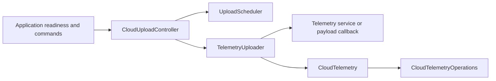

# Cloud Telemetry Delivery

Build, send, and schedule authenticated telemetry uploads while keeping network
transport separate from sensor acquisition and retry policy. Use the complete
pipeline for this application, or reuse the transport and scheduler individually
when another project has different payload or timing requirements.

## Components and Design

| Component | Responsibility |
| --- | --- |
| [CloudTelemetry.h](CloudTelemetry.h) | Validate upload arguments, assemble request metadata, invoke HTTPS transport, and classify its response. |
| `CloudTelemetryOperations` | Abstract synchronous send backend with a borrowed request and response-handler callback. |
| [TelemetryUploader.h](TelemetryUploader.h) | Build one payload through a telemetry service or callback and pass its exact bytes to transport. |
| [UploadScheduler.h](UploadScheduler.h) | Decide whether an upload is due from timestamps, pause/manual state, and the previous result. |
| [CloudUploadController.h](CloudUploadController.h) | Gate attempts on application readiness, invoke the uploader, and record completion-time scheduling results. |
| [TelemetryUploadResult.h](TelemetryUploadResult.h) | Typed success/failure category and underlying detail code shared across the pipeline. |



### CloudTelemetry

The transport accepts an endpoint, root certificate, API key, and placeholder
key through its constructor. It does not load configuration files or read
sensors. `begin()` reports configuration; it does not initiate a network request.
`upload(payload, length)` submits one synchronous request, and `isConfigured()`
checks whether the key is non-null, at least 32 characters, and not the placeholder.

The default AZ3166 backend uses the SDK HTTP client and sends JSON with
`X-Device-Key`, `Content-Type: application/json`, `Accept: application/json`, and
`Connection: close`. This is a telemetry-specific client, not a general HTTP
framework: only HTTP 201 is considered successful.

### TelemetryUploader

The uploader accepts a `CloudTelemetry` reference and either a `TelemetryService`
reference or a `TelemetryPayloadBuildFunction`. It provides the builder with a
160-byte buffer, validates the returned length, and forwards a valid payload.
Sensor errors, missing builders, empty payloads, and formatting errors return
typed results before any network call.

The callback is useful for adapting an existing payload source, but the current
buffer capacity and error codes follow this application's contract. It is not
an arbitrary-size upload facility.

### UploadScheduler

The scheduler has no sockets, sensor dependency, or internal clock. The caller
supplies `now` to `isUploadDue()` and `completedAt` to `recordResult()`, allowing
deterministic tests and reuse with another transport. Elapsed-time arithmetic
uses unsigned millisecond timestamps.

| Situation | Scheduling effect |
| --- | --- |
| Startup or resume | Scheduled work is due immediately unless suppressed by a non-retryable result. |
| Success | Next scheduled attempt waits for the normal interval. |
| Retryable failure | Next eligible attempt waits for the retry interval. |
| Non-retryable failure | Scheduled uploads remain suppressed until a successful manual recovery. |
| Pause | Stops scheduled uploads; it does not cancel a running request. |
| Manual request | Can run even while paused; repeated requests coalesce into a pending flag rather than a queue. |

A failed manual request remains pending for retry when its failure is retryable.
Resuming does not clear non-retryable suppression. The scheduler has no in-flight
guard: the caller must not start another attempt while one is already running.

### CloudUploadController

`update(prerequisitesReady)` requires readiness, configured credentials, a valid
clock, and a due scheduler before invoking one upload. It records the result
using the timestamp after the upload returns, not the start time. The application
normally supplies Wi-Fi and synchronized-time readiness.

`requestManualUpload()` and `togglePaused()` apply application commands without
depending on GPIO. An optional `CloudUploadClock` substitutes the clock for
tests; it remains a single-function callback.

## Reuse Patterns

For the full pipeline, construct a transport using the application's
[configuration](../config/README.md), then compose it with an initialized
[telemetry service](../telemetry/README.md):

```cpp
#include "src/cloud/TelemetryUploader.h"
#include "src/cloud/UploadScheduler.h"
#include "src/cloud/CloudUploadController.h"

TelemetryUploader uploader(cloudTelemetry, telemetry);
UploadScheduler scheduler(300000, 15000);
CloudUploadController uploads(scheduler, uploader);
```

Here `cloudTelemetry` and `telemetry` are existing application-owned objects.
Call `uploads.update(prerequisitesReady)` from one execution context and route
manual/pause commands from the application. The
[production sketch](../../AZ3166.ino) shows complete wiring and initialization.

For a different sender, use `UploadScheduler` directly: check
`isUploadDue(now)`, perform one attempt, map its outcome to `UploadScheduleResult`,
and call `recordResult(completedAt, result)` afterward. Preserve the completion
timestamp rule when adapting to an asynchronous sender.

For another network backend or a transport test, derive from
`CloudTelemetryOperations` and implement `send(request, responseHandler)`.
Inject it through the alternate `CloudTelemetry` constructor. The consumer
borrows the backend; construct it first and destroy it after its consumer.

## Results, Ownership, and Limits

| Upload result | Controller policy |
| --- | --- |
| `TELEMETRY_UPLOAD_SUCCESS` | Normal interval. |
| `TELEMETRY_UPLOAD_SENSOR_UNAVAILABLE` | Retryable failure. |
| `TELEMETRY_UPLOAD_NETWORK_ERROR` | Retryable failure; preserve platform error code. |
| `TELEMETRY_UPLOAD_HTTP_RETRYABLE` | Retryable HTTP 408, 422, 425, 429, or 5xx. |
| `TELEMETRY_UPLOAD_PAYLOAD_INVALID` | Non-retryable until manual recovery. |
| `TELEMETRY_UPLOAD_HTTP_REJECTED` | Other non-201 HTTP status; non-retryable. |
| `TELEMETRY_UPLOAD_DISABLED` | No configured upload or unavailable dependency; non-retryable if recorded. |

- Network work remains synchronous. These components do not create a cloud
  worker, queue jobs, or make the main loop nonblocking. Local HTTP responsiveness
  comes from the separate [HTTP worker](../http/README.md).
- The default transport needs AZ3166 Core 2.0.1, network access, a suitable TLS
  trust anchor, and a valid system time. Key validation alone does not prove the
  endpoint or certificate is usable.
- Endpoint, certificate, key, and placeholder pointers are borrowed. The
  controller and uploader also borrow their collaborators. Keep all of them
  alive for the duration of use, and synchronize application state if needed.
- A `send()` implementation must finish before returning. Request and payload
  pointers cannot be retained for deferred work; invoke the response handler
  while the response body is valid. Return a typed failure when unavailable.
- Scheduling state is held only in RAM. There is no durable offline backlog,
  per-device key rotation, or automatic certificate update mechanism.
- Serial diagnostics include telemetry and failed response bodies. The API key
  is sent as a header, not as payload or a serial diagnostic; still treat logs
  and device serial access as sensitive.

## Verification

From the repository root, compile the suites corresponding to the layer changed:

```powershell
& .\firmware\tests\run-cloud-telemetry-tests.ps1 -Action Verify
& .\firmware\tests\run-telemetry-uploader-tests.ps1 -Action Verify
& .\firmware\tests\run-upload-scheduler-tests.ps1 -Action Verify
& .\firmware\tests\run-cloud-upload-controller-tests.ps1 -Action Verify
```

They cover request metadata, typed responses, payload forwarding, independent
backends, retry timing, pause/manual behavior, and readiness gates. They do not
prove a real endpoint accepts uploads unless that integration is separately
exercised. Use focused checks rather than a full hardware sweep for every change.

See the [connectivity guide](../connectivity/README.md) and the
[firmware design](../../../../docs/firmware-design.md#10-cloud-upload).