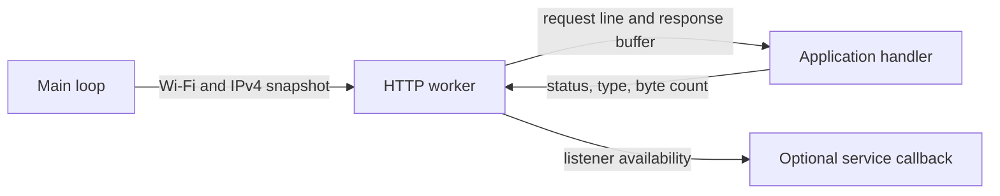

# Local HTTP Service

Run a small LAN HTTP service on the AZ3166 without tying request handling to
the Arduino main loop. The worker can serve clients while the main loop waits
for a cloud upload. It has no dependency on sensors, telemetry JSON, cloud
credentials, or mDNS.

## Components and Design

| Component | Responsibility |
| --- | --- |
| [LocalWebServer.h](LocalWebServer.h) | Worker lifecycle, listener readiness, connectivity reconciliation, and bounded HTTP I/O. |
| [LocalHttpHandler.h](LocalHttpHandler.h) | Application request handler and response contract: status, content type, and exact body length. |
| `LocalWebServerOperations` | Replaceable clock and socket operations for focused tests or another transport adapter. |
| `LocalHttpServiceUpdate` | Optional typed callback for listener availability, independent of the application handler. |



`update(wifiConnected, address)` publishes desired connectivity; it does not
handle a request on the calling thread. One worker owns the listener and client
sockets. It checks actual socket open/bind/listen results, retries failures, and
uses a connection generation to discard outdated startup and I/O work.
`state()` returns a synchronized readiness/address/error snapshot.

## Reuse in Another Sketch

Implement a handler and supply the port and startup retry interval. This example
serves a plain-text status route without the telemetry implementation:

```cpp
#include <string.h>
#include "src/http/LocalWebServer.h"

class StatusHandler : public LocalHttpHandler {
public:
    LocalHttpResponse handle(const char *requestLine, char *body,
                             size_t capacity) override {
        const char route[] = "GET /status ";
        bool found = strncmp(requestLine, route, sizeof(route) - 1) == 0;
        const char *message = found ? "ready\n" : "not found\n";
        size_t length = strlen(message);
        if (length > capacity) {
            return {"500 Internal Server Error", "text/plain", 0};
        }
        memcpy(body, message, length);
        return {found ? "200 OK" : "404 Not Found", "text/plain", length};
    }
};

StatusHandler handler;
LocalWebServer http(handler, 8080, 5000);
```

After application initialization, call `http.update(wifiConnected, ipv4Address)`
from the main loop whenever reconciling connectivity. The address uses the first
IPv4 octet in the most significant byte: `192.0.2.1` is `0xC0000201`. Pass zero
when no address is available. `update(false, 0)` requests listener shutdown but
retains the worker for a later reconnect.

The existing [TelemetryHttpHandler.h](../telemetry/TelemetryHttpHandler.h) is one
application adapter, not part of the HTTP engine. Another handler can expose a
different route, payload, or content type using the same server.

## Advertisement and Ownership

Pass `mbed::callback(&discovery, &LocalDiscovery::update)` as the optional final
constructor argument to connect an existing discovery object. See the
[discovery guide](../discovery/README.md) for its metadata configuration.

- Service callbacks run on the HTTP worker after successful listener startup and
  while it remains available. They are repeated reconciliation calls, not only
  one-shot transition notifications.
- The handler and callback target must outlive the server. A copied Mbed callback
  does not own its target. Status and content-type strings returned by a handler
  must remain valid until transmission finishes.
- Shared application state needs its own synchronization. Keep sensor locks
  short and release them before network operations.
- Destroying the server requests worker shutdown and joins it. Handlers and
  callbacks must finish; neither may destroy the server from its own worker.
- Derive from `LocalWebServerOperations` to replace the clock and socket backend.
  The injection constructor borrows it by reference: it must outlive the server,
  including worker shutdown and join. The default backend has process lifetime.
- Custom operations must use bounded/nonblocking I/O. Their clock can be called
  from both the main loop and the HTTP worker; keep referenced state valid and
  synchronized. An interface does not provide thread safety by itself.

## Limits and Dependencies

- AZ3166 Core 2.0.1, Mbed RTOS, and lwIP are required by the default backend.
- One client is handled at a time. The worker uses a 6144-byte stack allocated
  at startup, plus RTOS and socket resources.
- Request line: 96 bytes; total request headers: 2048 bytes; response body:
  512 bytes. Header reads and response writes each have a two-second deadline.
- Responses include `Content-Length` and `Connection: close`; partial writes are
  handled. Bodies may contain binary data within the supplied buffer limit.
- Request bodies, persistent connections, WebSockets, TLS, and authentication
  are not implemented. Use this service only on a trusted LAN.
- A slow client can delay another client. Threads do not remove network limits
  or bound arbitrary handler execution. The main-loop watchdog does not provide
  a separate HTTP-worker health check.

## Verification and Related Guides

From the repository root, compile the focused suite:

```powershell
& .\firmware\tests\run-local-web-server-tests.ps1 -Action Verify
```

The suite covers routing adapters, worker execution, listener lifecycle,
callback binding, partial I/O, binary responses, bounds, timeouts, and cleanup.
Board runs use `-Action Run -Port COMx` with the detected ST-Link port and restore
production afterward. Do not treat a compile-only result as a runtime pass.

See [LocalWebServer.cpp](LocalWebServer.cpp), the
[telemetry guide](../telemetry/README.md), and the
[firmware design](../../../../docs/firmware-design.md#9-local-http-interface).